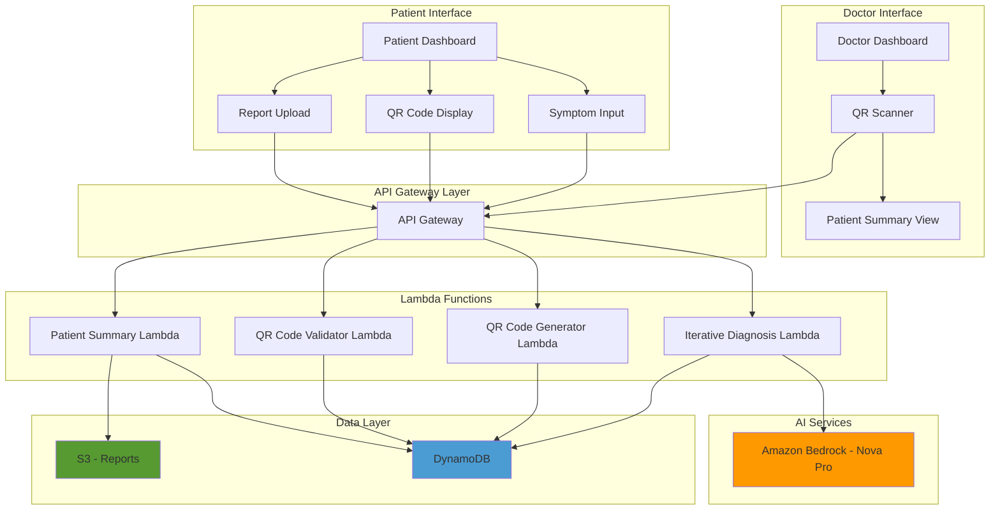
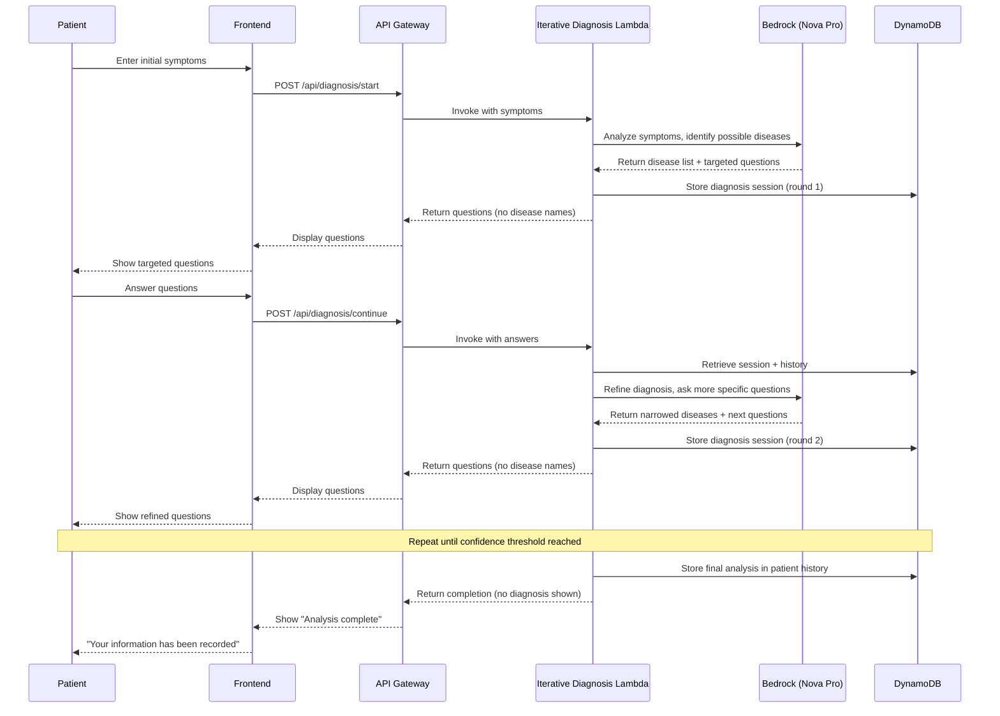
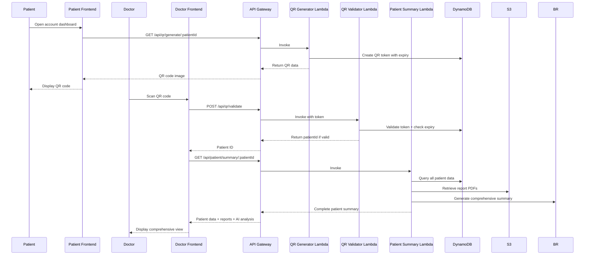
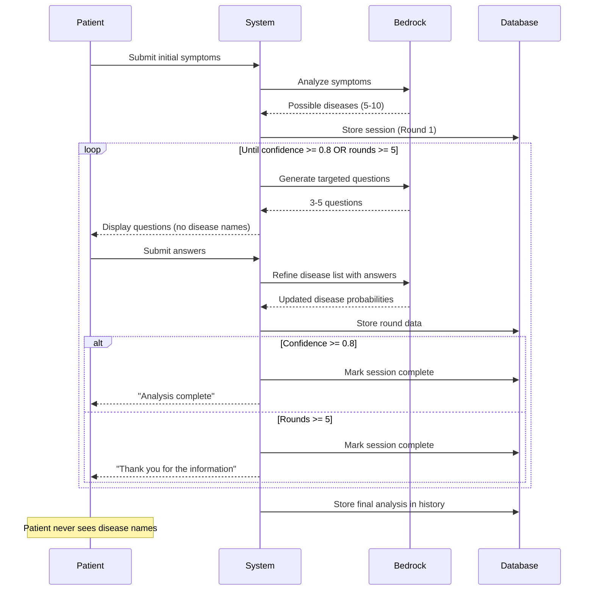

# Design Document: AI-Powered Iterative Diagnosis and QR Code Functionality

## Overview

This feature enhances the CareNav AI system with intelligent, iterative symptom analysis and QR code-based patient data sharing. Instead of asking generic questions, the AI analyzes symptoms to determine possible diseases, then asks progressively targeted questions to narrow down the diagnosis. The system stores all findings in patient history without revealing diagnosis to the patient. Doctors can scan a QR code displayed in the patient's account to access complete symptom history, uploaded reports, and AI-generated analysis.

The feature maintains the system's core principle of not providing diagnosis to patients while enabling doctors to access comprehensive, AI-analyzed patient data through a secure, convenient QR code interface.

## Architecture

### High-Level System Architecture



### Sequence Diagram: Iterative Diagnosis Flow




### Sequence Diagram: QR Code Flow




## Components and Interfaces

### Component 1: Iterative Diagnosis Engine

**Purpose**: Analyze symptoms, identify possible diseases, and generate progressively targeted questions to narrow down diagnosis

**Interface**:
```typescript
interface DiagnosisSession {
  sessionId: string;
  patientId: string;
  currentRound: number;
  initialSymptoms: StructuredSymptoms;
  possibleDiseases: DiseaseCandidate[];
  questionHistory: QuestionRound[];
  confidenceScore: number;
  status: 'active' | 'completed';
  createdAt: string;
  updatedAt: string;
}

interface DiseaseCandidate {
  diseaseName: string;
  probability: number;
  supportingSymptoms: string[];
  missingSymptoms: string[];
}

interface QuestionRound {
  roundNumber: number;
  questions: TargetedQuestion[];
  answers: QuestionAnswer[];
  diseasesBeforeRound: DiseaseCandidate[];
  diseasesAfterRound: DiseaseCandidate[];
  timestamp: string;
}

interface TargetedQuestion {
  questionId: string;
  questionText: string;
  questionType: 'yes_no' | 'text' | 'multiple_choice' | 'scale';
  targetDiseases: string[]; // Which diseases this question helps differentiate
  importance: 'high' | 'medium' | 'low';
  options?: string[]; // For multiple_choice type
}

interface QuestionAnswer {
  questionId: string;
  answer: string;
  timestamp: string;
}
```

**Responsibilities**:
- Analyze initial symptoms to identify possible diseases
- Generate targeted questions based on disease differentiation needs
- Process answers to refine disease probability list
- Determine when sufficient information has been gathered
- Store complete analysis in patient history without revealing to patient


### Component 2: QR Code Generator

**Purpose**: Generate secure, time-limited QR codes for patient data access

**Interface**:
```typescript
interface QRCodeToken {
  tokenId: string;
  patientId: string;
  qrData: string; // Encrypted token string
  expiresAt: string; // Token valid for 24 hours
  createdAt: string;
  scannedBy?: string; // Doctor ID who scanned
  scannedAt?: string;
}

interface QRCodeResponse {
  qrCodeImage: string; // Base64 encoded PNG
  qrData: string; // Raw token for QR code
  expiresAt: string;
  expiresIn: number; // Seconds until expiry
}
```

**Responsibilities**:
- Generate unique, secure tokens for each patient
- Create QR code image from token
- Set expiration time (24 hours default)
- Store token in DynamoDB for validation
- Support token refresh when expired

### Component 3: QR Code Validator

**Purpose**: Validate scanned QR codes and authorize doctor access

**Interface**:
```typescript
interface QRValidationRequest {
  qrData: string;
  doctorId: string;
}

interface QRValidationResponse {
  valid: boolean;
  patientId?: string;
  error?: string;
  expiresAt?: string;
}
```

**Responsibilities**:
- Validate QR token exists and is not expired
- Decrypt and verify token integrity
- Record scan event (doctor ID, timestamp)
- Return patient ID for authorized access
- Handle expired or invalid tokens gracefully


### Component 4: Patient Summary Generator

**Purpose**: Compile comprehensive patient data for doctor view after QR scan

**Interface**:
```typescript
interface PatientSummary {
  patient: Patient;
  diagnosisSessions: DiagnosisSessionSummary[];
  symptoms: SymptomHistory[];
  reports: ReportWithAnalysis[];
  aiAnalysis: ComprehensiveAnalysis;
  redFlags: RedFlag[];
  treatmentHistory: TreatmentPlan[];
  generatedAt: string;
}

interface DiagnosisSessionSummary {
  sessionId: string;
  date: string;
  initialSymptoms: StructuredSymptoms;
  finalDiseases: DiseaseCandidate[];
  totalRounds: number;
  confidenceScore: number;
  keyFindings: string[];
}

interface ReportWithAnalysis {
  reportId: string;
  reportType: string;
  uploadDate: string;
  s3Key: string;
  pdfUrl: string; // Pre-signed S3 URL
  summary: ReportSummary;
  aiInsights: string[];
}

interface ComprehensiveAnalysis {
  overallHealthStatus: string;
  chronicConditions: string[];
  recentSymptomPatterns: string[];
  reportTrends: string[];
  recommendations: string[];
  criticalAlerts: string[];
}

interface RedFlag {
  type: 'allergy' | 'chronic_condition' | 'high_risk' | 'medication_interaction';
  description: string;
  source: string; // Which data source identified this
  severity: 'critical' | 'high' | 'medium';
  detectedAt: string;
}
```

**Responsibilities**:
- Aggregate all patient data from multiple sources
- Generate pre-signed S3 URLs for report PDFs
- Use Bedrock to create comprehensive AI analysis
- Identify and highlight red flags
- Format data for doctor-friendly display
- Include diagnosis session details with disease probabilities


## Data Models

### DynamoDB Schema Extensions

#### Diagnosis Sessions Table
```typescript
{
  PK: "PATIENT#{patientId}",
  SK: "DIAGNOSIS_SESSION#{sessionId}",
  sessionId: string,
  patientId: string,
  currentRound: number,
  initialSymptoms: StructuredSymptoms,
  possibleDiseases: DiseaseCandidate[],
  questionHistory: QuestionRound[],
  confidenceScore: number,
  status: 'active' | 'completed',
  createdAt: string,
  updatedAt: string,
  GSI1PK: "DIAGNOSIS_SESSION", // For querying all sessions
  GSI1SK: createdAt
}
```

#### QR Code Tokens Table
```typescript
{
  PK: "QR_TOKEN#{tokenId}",
  SK: "METADATA",
  tokenId: string,
  patientId: string,
  qrData: string,
  expiresAt: string,
  createdAt: string,
  scannedBy?: string,
  scannedAt?: string,
  TTL: number // DynamoDB TTL for automatic cleanup
}
```

#### Patient History Extensions
```typescript
{
  PK: "PATIENT#{patientId}",
  SK: "HISTORY_SUMMARY",
  patientId: string,
  totalDiagnosisSessions: number,
  lastDiagnosisDate: string,
  chronicConditionsIdentified: string[],
  redFlagsCount: number,
  lastQRGenerated: string,
  lastQRScanned: string,
  updatedAt: string
}
```

### S3 Bucket Structure Extensions
```
carenav-medical-reports/
  {patientId}/
    reports/
      {reportId}.pdf
      {reportId}.jpg
    qr-codes/
      {tokenId}.png  # Optional: Store generated QR images
```


## Main Algorithm/Workflow

### Iterative Diagnosis Algorithm




## Key Functions with Formal Specifications

### Function 1: startDiagnosisSession()

```typescript
function startDiagnosisSession(
  patientId: string,
  symptoms: StructuredSymptoms
): Promise<DiagnosisSessionResponse>
```

**Preconditions:**
- `patientId` is a valid, non-empty string
- `symptoms` contains at least `bodyPart` and `duration` fields
- `symptoms.severity` is one of: 'mild', 'moderate', 'severe'
- Patient exists in database

**Postconditions:**
- Returns valid `DiagnosisSessionResponse` with `sessionId`
- New diagnosis session created in DynamoDB
- `possibleDiseases` array contains 5-10 disease candidates
- `currentRound` is set to 1
- `status` is set to 'active'
- First set of targeted questions returned (3-5 questions)
- No disease names included in questions shown to patient

**Loop Invariants:** N/A (no loops in this function)

### Function 2: continueDignosisSession()

```typescript
function continueDiagnosisSession(
  sessionId: string,
  answers: QuestionAnswer[]
): Promise<DiagnosisSessionResponse>
```

**Preconditions:**
- `sessionId` exists in database
- Session `status` is 'active'
- `answers` array is non-empty
- Each answer corresponds to a question from previous round
- `answers.length` matches number of questions asked

**Postconditions:**
- Returns valid `DiagnosisSessionResponse`
- Session updated in DynamoDB with new round data
- `currentRound` incremented by 1
- `possibleDiseases` list refined based on answers
- `confidenceScore` updated (0.0 to 1.0)
- If `confidenceScore >= 0.8` OR `currentRound >= 5`: session marked 'completed'
- If session continues: new targeted questions returned (3-5 questions)
- Disease probabilities recalculated for all candidates

**Loop Invariants:**
- All previous rounds' data preserved in `questionHistory`
- `possibleDiseases` list never increases in size (only decreases or stays same)
- Confidence score is monotonically non-decreasing


### Function 3: generateQRCode()

```typescript
function generateQRCode(
  patientId: string
): Promise<QRCodeResponse>
```

**Preconditions:**
- `patientId` is a valid, non-empty string
- Patient exists in database

**Postconditions:**
- Returns valid `QRCodeResponse` with base64 QR image
- New QR token created in DynamoDB
- Token expires in 24 hours from creation
- `qrData` is encrypted and tamper-proof
- QR code image is valid PNG format
- Token can be validated by `validateQRCode()` function

**Loop Invariants:** N/A

### Function 4: validateQRCode()

```typescript
function validateQRCode(
  qrData: string,
  doctorId: string
): Promise<QRValidationResponse>
```

**Preconditions:**
- `qrData` is non-empty string
- `doctorId` is valid doctor identifier

**Postconditions:**
- Returns `QRValidationResponse` with `valid` boolean
- If valid: `patientId` included in response
- If valid: scan event recorded in DynamoDB (doctorId, timestamp)
- If expired: `valid` is false, error message provided
- If invalid format: `valid` is false, error message provided
- Token expiry checked against current timestamp

**Loop Invariants:** N/A


### Function 5: generatePatientSummary()

```typescript
function generatePatientSummary(
  patientId: string,
  doctorId: string
): Promise<PatientSummary>
```

**Preconditions:**
- `patientId` is valid and exists in database
- `doctorId` has authorization to view patient data
- Doctor has successfully scanned valid QR code

**Postconditions:**
- Returns complete `PatientSummary` object
- All diagnosis sessions retrieved and summarized
- All reports retrieved with pre-signed S3 URLs (valid for 1 hour)
- AI comprehensive analysis generated via Bedrock
- Red flags identified and categorized by severity
- Treatment history included if exists
- Summary generation timestamp recorded
- No errors thrown for missing optional data (reports, treatments)

**Loop Invariants:**
- For each diagnosis session: all rounds processed in chronological order
- For each report: summary and AI insights included
- For each red flag: source and severity properly set


## Algorithmic Pseudocode

### Main Iterative Diagnosis Algorithm

```typescript
ALGORITHM iterativeDiagnosisEngine(patientId, initialSymptoms)
INPUT: patientId (string), initialSymptoms (StructuredSymptoms)
OUTPUT: DiagnosisSession (complete session with all rounds)

BEGIN
  ASSERT patientId is non-empty
  ASSERT initialSymptoms contains required fields
  
  // Step 1: Initialize session
  sessionId ← generateUUID()
  currentRound ← 1
  confidenceScore ← 0.0
  maxRounds ← 5
  confidenceThreshold ← 0.8
  
  // Step 2: Analyze initial symptoms to identify possible diseases
  possibleDiseases ← callBedrock_AnalyzeSymptoms(initialSymptoms)
  ASSERT possibleDiseases.length >= 5 AND possibleDiseases.length <= 10
  
  // Step 3: Store initial session
  session ← createDiagnosisSession(sessionId, patientId, initialSymptoms, possibleDiseases)
  storeToDynamoDB(session)
  
  // Step 4: Iterative refinement loop
  WHILE confidenceScore < confidenceThreshold AND currentRound <= maxRounds DO
    ASSERT session.status = 'active'
    ASSERT possibleDiseases.length > 0
    
    // Generate targeted questions based on current disease candidates
    targetedQuestions ← callBedrock_GenerateQuestions(
      possibleDiseases,
      questionHistory,
      currentRound
    )
    
    ASSERT targetedQuestions.length >= 3 AND targetedQuestions.length <= 5
    ASSERT NO disease names in targetedQuestions
    
    // Wait for patient answers (async - handled by API)
    answers ← waitForPatientAnswers(sessionId, targetedQuestions)
    
    ASSERT answers.length = targetedQuestions.length
    
    // Refine disease list based on answers
    refinedDiseases ← callBedrock_RefineDisease(
      possibleDiseases,
      answers,
      initialSymptoms
    )
    
    // Calculate new confidence score
    confidenceScore ← calculateConfidence(refinedDiseases)
    
    ASSERT confidenceScore >= 0.0 AND confidenceScore <= 1.0
    ASSERT confidenceScore >= previous confidenceScore
    
    // Store round data
    roundData ← createQuestionRound(
      currentRound,
      targetedQuestions,
      answers,
      possibleDiseases,
      refinedDiseases
    )
    
    session.questionHistory.append(roundData)
    session.possibleDiseases ← refinedDiseases
    session.confidenceScore ← confidenceScore
    session.currentRound ← currentRound + 1
    
    updateDynamoDB(session)
    
    currentRound ← currentRound + 1
  END WHILE
  
  // Step 5: Mark session complete
  session.status ← 'completed'
  updateDynamoDB(session)
  
  // Step 6: Store in patient history (hidden from patient)
  storeToPatientHistory(patientId, session)
  
  ASSERT session.status = 'completed'
  ASSERT session.questionHistory.length >= 1
  
  RETURN session
END
```

**Preconditions:**
- patientId exists in database
- initialSymptoms is well-formed with required fields
- Bedrock API is available

**Postconditions:**
- Complete diagnosis session stored in database
- Session status is 'completed'
- At least 1 round of questions asked
- Confidence score calculated
- Patient history updated
- No disease names exposed to patient interface

**Loop Invariants:**
- `currentRound` increases by 1 each iteration
- `possibleDiseases` list size decreases or stays same
- `confidenceScore` is non-decreasing
- All previous rounds preserved in `questionHistory`
- Session remains in 'active' status during loop


### QR Code Generation Algorithm

```typescript
ALGORITHM generateQRCodeForPatient(patientId)
INPUT: patientId (string)
OUTPUT: QRCodeResponse (QR image and token data)

BEGIN
  ASSERT patientId is non-empty
  ASSERT patient exists in database
  
  // Step 1: Generate unique token
  tokenId ← generateUUID()
  currentTime ← getCurrentTimestamp()
  expiryTime ← currentTime + 24_HOURS
  
  // Step 2: Create encrypted token payload
  payload ← {
    tokenId: tokenId,
    patientId: patientId,
    issuedAt: currentTime,
    expiresAt: expiryTime
  }
  
  encryptedToken ← encryptWithAES256(payload, SECRET_KEY)
  qrData ← base64Encode(encryptedToken)
  
  ASSERT qrData.length > 0
  
  // Step 3: Generate QR code image
  qrCodeImage ← generateQRCodeImage(qrData, {
    errorCorrectionLevel: 'H',
    width: 300,
    margin: 2
  })
  
  ASSERT qrCodeImage is valid PNG
  
  // Step 4: Store token in DynamoDB
  tokenRecord ← {
    PK: "QR_TOKEN#" + tokenId,
    SK: "METADATA",
    tokenId: tokenId,
    patientId: patientId,
    qrData: qrData,
    expiresAt: expiryTime,
    createdAt: currentTime,
    TTL: expiryTime + 1_HOUR // DynamoDB auto-cleanup
  }
  
  storeToDynamoDB(tokenRecord)
  
  // Step 5: Update patient history
  updatePatientHistory(patientId, {
    lastQRGenerated: currentTime
  })
  
  response ← {
    qrCodeImage: base64Encode(qrCodeImage),
    qrData: qrData,
    expiresAt: expiryTime,
    expiresIn: 86400 // 24 hours in seconds
  }
  
  ASSERT response.qrCodeImage is non-empty
  ASSERT response.expiresAt > currentTime
  
  RETURN response
END
```

**Preconditions:**
- patientId is valid and exists
- Encryption key available in environment
- DynamoDB table accessible

**Postconditions:**
- Valid QR code image generated
- Token stored in database with expiry
- Token is encrypted and tamper-proof
- QR code can be scanned and validated
- Patient history updated with generation timestamp


### QR Code Validation Algorithm

```typescript
ALGORITHM validateQRCodeToken(qrData, doctorId)
INPUT: qrData (string), doctorId (string)
OUTPUT: QRValidationResponse (validation result with patientId)

BEGIN
  ASSERT qrData is non-empty
  ASSERT doctorId is non-empty
  
  TRY
    // Step 1: Decrypt and decode token
    encryptedToken ← base64Decode(qrData)
    payload ← decryptWithAES256(encryptedToken, SECRET_KEY)
    
    ASSERT payload contains tokenId, patientId, expiresAt
    
    tokenId ← payload.tokenId
    patientId ← payload.patientId
    expiresAt ← payload.expiresAt
    
    // Step 2: Retrieve token from database
    tokenRecord ← queryDynamoDB({
      PK: "QR_TOKEN#" + tokenId,
      SK: "METADATA"
    })
    
    IF tokenRecord is NULL THEN
      RETURN {
        valid: false,
        error: "Invalid QR code"
      }
    END IF
    
    // Step 3: Check expiration
    currentTime ← getCurrentTimestamp()
    
    IF currentTime > expiresAt THEN
      RETURN {
        valid: false,
        error: "QR code has expired. Please generate a new one."
      }
    END IF
    
    // Step 4: Verify token integrity
    IF tokenRecord.patientId ≠ patientId THEN
      RETURN {
        valid: false,
        error: "Token integrity check failed"
      }
    END IF
    
    // Step 5: Record scan event
    updateDynamoDB(tokenRecord, {
      scannedBy: doctorId,
      scannedAt: currentTime
    })
    
    // Step 6: Update patient history
    updatePatientHistory(patientId, {
      lastQRScanned: currentTime,
      lastScannedBy: doctorId
    })
    
    RETURN {
      valid: true,
      patientId: patientId,
      expiresAt: expiresAt
    }
    
  CATCH DecryptionError
    RETURN {
      valid: false,
      error: "Invalid QR code format"
    }
  CATCH DatabaseError
    RETURN {
      valid: false,
      error: "Unable to validate QR code. Please try again."
    }
  END TRY
END
```

**Preconditions:**
- qrData is provided (may be invalid)
- doctorId is valid doctor identifier
- Decryption key available
- Database accessible

**Postconditions:**
- Returns validation result with boolean `valid`
- If valid: patientId included in response
- If valid: scan event recorded with doctor ID and timestamp
- If invalid: descriptive error message provided
- Patient history updated on successful validation
- No exceptions thrown (all errors caught and returned)


### Patient Summary Generation Algorithm

```typescript
ALGORITHM generateComprehensivePatientSummary(patientId, doctorId)
INPUT: patientId (string), doctorId (string)
OUTPUT: PatientSummary (complete patient data with AI analysis)

BEGIN
  ASSERT patientId is non-empty
  ASSERT doctorId is non-empty
  ASSERT doctor has valid QR scan authorization
  
  // Step 1: Retrieve patient profile
  patient ← queryDynamoDB({
    PK: "PATIENT#" + patientId,
    SK: "PROFILE"
  })
  
  ASSERT patient is not NULL
  
  // Step 2: Retrieve all diagnosis sessions
  diagnosisSessions ← queryDynamoDB({
    PK: "PATIENT#" + patientId,
    SK_begins_with: "DIAGNOSIS_SESSION#"
  })
  
  sessionSummaries ← []
  FOR each session IN diagnosisSessions DO
    summary ← {
      sessionId: session.sessionId,
      date: session.createdAt,
      initialSymptoms: session.initialSymptoms,
      finalDiseases: session.possibleDiseases,
      totalRounds: session.currentRound,
      confidenceScore: session.confidenceScore,
      keyFindings: extractKeyFindings(session)
    }
    sessionSummaries.append(summary)
  END FOR
  
  // Step 3: Retrieve all symptoms
  symptoms ← queryDynamoDB({
    PK: "PATIENT#" + patientId,
    SK_begins_with: "SYMPTOM#"
  })
  
  // Step 4: Retrieve all reports with S3 URLs
  reports ← queryDynamoDB({
    PK: "PATIENT#" + patientId,
    SK_begins_with: "REPORT#"
  })
  
  reportsWithAnalysis ← []
  FOR each report IN reports DO
    // Generate pre-signed S3 URL (valid for 1 hour)
    pdfUrl ← generatePresignedS3URL(report.s3Key, expiresIn: 3600)
    
    // Get AI insights for this report
    aiInsights ← callBedrock_AnalyzeReport(report.summary)
    
    reportData ← {
      reportId: report.reportId,
      reportType: report.summary.reportType,
      uploadDate: report.uploadedAt,
      s3Key: report.s3Key,
      pdfUrl: pdfUrl,
      summary: report.summary,
      aiInsights: aiInsights
    }
    reportsWithAnalysis.append(reportData)
  END FOR
  
  // Step 5: Retrieve treatment history
  treatments ← queryDynamoDB({
    PK: "PATIENT#" + patientId,
    SK_begins_with: "TREATMENT#"
  })
  
  // Step 6: Identify red flags
  redFlags ← []
  
  // Check diagnosis sessions for red flags
  FOR each session IN diagnosisSessions DO
    FOR each disease IN session.possibleDiseases DO
      IF disease.probability > 0.7 AND isHighRiskDisease(disease.diseaseName) THEN
        redFlags.append({
          type: 'high_risk',
          description: disease.diseaseName + " (probability: " + disease.probability + ")",
          source: "Diagnosis Session " + session.sessionId,
          severity: 'high',
          detectedAt: session.createdAt
        })
      END IF
    END FOR
  END FOR
  
  // Check reports for red flags
  FOR each report IN reports DO
    FOR each flag IN report.summary.redFlags DO
      redFlags.append({
        type: categorizeRedFlag(flag),
        description: flag,
        source: "Medical Report " + report.reportId,
        severity: determineSeverity(flag),
        detectedAt: report.uploadedAt
      })
    END FOR
  END FOR
  
  // Step 7: Generate comprehensive AI analysis
  comprehensiveAnalysis ← callBedrock_GenerateComprehensiveAnalysis({
    patient: patient,
    diagnosisSessions: sessionSummaries,
    symptoms: symptoms,
    reports: reportsWithAnalysis,
    treatments: treatments,
    redFlags: redFlags
  })
  
  ASSERT comprehensiveAnalysis contains all required fields
  
  // Step 8: Assemble final summary
  summary ← {
    patient: patient,
    diagnosisSessions: sessionSummaries,
    symptoms: symptoms,
    reports: reportsWithAnalysis,
    aiAnalysis: comprehensiveAnalysis,
    redFlags: sortBySevertiy(redFlags),
    treatmentHistory: treatments,
    generatedAt: getCurrentTimestamp()
  }
  
  ASSERT summary.patient is not NULL
  ASSERT summary.aiAnalysis is not NULL
  
  RETURN summary
END
```

**Preconditions:**
- patientId exists in database
- doctorId has scanned valid QR code
- All required AWS services accessible (DynamoDB, S3, Bedrock)

**Postconditions:**
- Complete patient summary returned
- All diagnosis sessions included with disease probabilities
- All reports included with pre-signed S3 URLs (valid 1 hour)
- AI comprehensive analysis generated
- Red flags identified and sorted by severity
- Treatment history included if exists
- No sensitive data omitted
- Summary generation timestamp recorded

**Loop Invariants:**
- For diagnosis sessions loop: all sessions processed, summaries created
- For reports loop: all reports have valid S3 URLs and AI insights
- For red flags loop: all high-risk items identified and categorized


## Example Usage

### Example 1: Starting Iterative Diagnosis Session

```typescript
// Patient submits initial symptoms
const initialSymptoms: StructuredSymptoms = {
  bodyPart: "chest",
  duration: "3 days",
  severity: "moderate",
  associatedFactors: ["shortness of breath", "sweating"],
  timing: "worse with exertion",
  character: "pressure-like discomfort"
};

// Start diagnosis session
const session = await startDiagnosisSession("patient-123", initialSymptoms);

// Response (Round 1)
{
  sessionId: "session-abc-123",
  currentRound: 1,
  questions: [
    {
      questionId: "q1",
      questionText: "Does the discomfort spread to your arm, neck, or jaw?",
      questionType: "yes_no",
      importance: "high"
    },
    {
      questionId: "q2",
      questionText: "Have you experienced nausea or lightheadedness?",
      questionType: "yes_no",
      importance: "high"
    },
    {
      questionId: "q3",
      questionText: "Do you have a history of heart problems in your family?",
      questionType: "yes_no",
      importance: "medium"
    }
  ],
  status: "active"
}

// Patient answers questions
const answers: QuestionAnswer[] = [
  { questionId: "q1", answer: "yes", timestamp: "2024-01-15T10:30:00Z" },
  { questionId: "q2", answer: "yes", timestamp: "2024-01-15T10:30:15Z" },
  { questionId: "q3", answer: "no", timestamp: "2024-01-15T10:30:30Z" }
];

// Continue session with answers
const updatedSession = await continueDiagnosisSession("session-abc-123", answers);

// Response (Round 2)
{
  sessionId: "session-abc-123",
  currentRound: 2,
  confidenceScore: 0.65,
  questions: [
    {
      questionId: "q4",
      questionText: "On a scale of 1-10, how would you rate the intensity?",
      questionType: "scale",
      importance: "medium"
    },
    {
      questionId: "q5",
      questionText: "Does rest make the discomfort better?",
      questionType: "yes_no",
      importance: "high"
    }
  ],
  status: "active"
}

// After sufficient rounds (confidence >= 0.8 or rounds >= 5)
{
  sessionId: "session-abc-123",
  currentRound: 4,
  confidenceScore: 0.85,
  status: "completed",
  message: "Thank you. Your information has been recorded for your doctor."
}
```


### Example 2: QR Code Generation and Scanning

```typescript
// Patient generates QR code
const qrResponse = await generateQRCode("patient-123");

{
  qrCodeImage: "data:image/png;base64,iVBORw0KGgoAAAANSUhEUgAA...",
  qrData: "eyJ0b2tlbklkIjoiYWJjLTEyMyIsInBhdGllbnRJZCI6InBhdGllbnQtMTIzIi...",
  expiresAt: "2024-01-16T10:00:00Z",
  expiresIn: 86400
}

// Doctor scans QR code
const validation = await validateQRCode(qrResponse.qrData, "doctor-456");

{
  valid: true,
  patientId: "patient-123",
  expiresAt: "2024-01-16T10:00:00Z"
}

// Doctor retrieves patient summary
const summary = await generatePatientSummary("patient-123", "doctor-456");

{
  patient: {
    patientId: "patient-123",
    name: "Rajesh Kumar",
    age: 45,
    gender: "Male"
  },
  diagnosisSessions: [
    {
      sessionId: "session-abc-123",
      date: "2024-01-15T10:00:00Z",
      initialSymptoms: {
        bodyPart: "chest",
        duration: "3 days",
        severity: "moderate"
      },
      finalDiseases: [
        {
          diseaseName: "Angina Pectoris",
          probability: 0.85,
          supportingSymptoms: ["chest pressure", "exertional", "radiating pain"]
        },
        {
          diseaseName: "Myocardial Infarction",
          probability: 0.65,
          supportingSymptoms: ["chest discomfort", "sweating", "nausea"]
        }
      ],
      totalRounds: 4,
      confidenceScore: 0.85,
      keyFindings: [
        "Chest discomfort radiating to arm and jaw",
        "Symptoms worse with exertion",
        "Associated with sweating and nausea"
      ]
    }
  ],
  reports: [
    {
      reportId: "report-789",
      reportType: "ECG",
      uploadDate: "2024-01-10T14:00:00Z",
      pdfUrl: "https://s3.amazonaws.com/carenav-reports/patient-123/report-789.pdf?X-Amz-Expires=3600...",
      summary: {
        keyFindings: ["Normal sinus rhythm", "No ST elevation"],
        reportDate: "2024-01-10"
      },
      aiInsights: [
        "ECG shows normal sinus rhythm",
        "No acute ischemic changes detected",
        "Consider stress test for exertional symptoms"
      ]
    }
  ],
  aiAnalysis: {
    overallHealthStatus: "Patient presenting with concerning cardiac symptoms requiring urgent evaluation",
    chronicConditions: [],
    recentSymptomPatterns: [
      "Exertional chest discomfort with radiation",
      "Associated autonomic symptoms (sweating, nausea)"
    ],
    reportTrends: [
      "Previous ECG normal, but symptoms suggest possible unstable angina"
    ],
    recommendations: [
      "Urgent cardiology consultation recommended",
      "Consider troponin levels and stress testing",
      "Patient should avoid strenuous activity until evaluated"
    ],
    criticalAlerts: [
      "High probability cardiac etiology - urgent evaluation needed"
    ]
  },
  redFlags: [
    {
      type: "high_risk",
      description: "Angina Pectoris (probability: 0.85)",
      source: "Diagnosis Session session-abc-123",
      severity: "high",
      detectedAt: "2024-01-15T10:00:00Z"
    }
  ],
  treatmentHistory: [],
  generatedAt: "2024-01-15T11:00:00Z"
}
```


## Correctness Properties

*A property is a characteristic or behavior that should hold true across all valid executions of a system—essentially, a formal statement about what the system should do. Properties serve as the bridge between human-readable specifications and machine-verifiable correctness guarantees.*

### Property 1: Disease Name Isolation

*For any* diagnosis session and any set of questions generated for patients, no disease names from the possibleDiseases list should appear in the questionText field of any question.

**Validates: Requirements 3.6, 4.1, 4.2, 4.3**

### Property 2: Session Convergence

*For any* diagnosis session, when confidenceScore reaches 0.8 or higher OR currentRound reaches 5, the session status should be marked as 'completed'.

**Validates: Requirements 1.7, 1.8, 5.4**

### Property 3: QR Token Expiry

*For any* QR token, if the current time is greater than the token's expiresAt timestamp, validation should return valid as false with an expiry error message.

**Validates: Requirements 7.7, 11.3**

### Property 4: QR Token Round Trip

*For any* valid QR token payload, encrypting then decrypting should produce an equivalent payload with all original fields intact (tokenId, patientId, issuedAt, expiresAt).

**Validates: Requirements 6.3, 6.4, 7.2, 7.4**

### Property 5: Data Completeness in Summary

*For any* patient summary generated after valid QR scan, the summary should contain all diagnosis sessions with complete data, all reports with valid pre-signed S3 URLs, and AI comprehensive analysis with all required fields.

**Validates: Requirements 8.3, 8.7, 8.11, 8.12**

### Property 6: Monotonic Confidence

*For any* diagnosis session, when processing a new round of answers, the updated confidenceScore should be greater than or equal to the previous round's confidenceScore.

**Validates: Requirements 5.2**

### Property 7: Disease Candidate Bounds

*For any* initial symptom analysis, the number of disease candidates identified should be between 5 and 10 inclusive, and their probability scores should sum to approximately 1.0 (within 0.05 tolerance).

**Validates: Requirements 1.3, 1.4**

### Property 8: Disease List Monotonic Decrease

*For any* diagnosis session, when disease probabilities are refined after a round, the number of disease candidates should decrease or stay the same, never increase.

**Validates: Requirements 2.6, 2.7**

### Property 9: Question Generation Bounds

*For any* set of disease candidates, the number of targeted questions generated should be between 3 and 5 inclusive, and each question should have a unique questionId.

**Validates: Requirements 3.1, 3.2**

### Property 10: Question Type Validity

*For any* generated question, the questionType should be one of: yes_no, text, multiple_choice, or scale; the importance should be one of: high, medium, or low; and if questionType is multiple_choice, the options array should contain at least 2 choices.

**Validates: Requirements 3.3, 3.4, 3.8**

### Property 11: Session ID Uniqueness

*For any* set of diagnosis sessions created, all sessionIds should be unique across the entire system.

**Validates: Requirements 1.2**

### Property 12: Round Increment

*For any* diagnosis session, when patient answers are submitted, the currentRound should increment by exactly 1.

**Validates: Requirements 1.6**

### Property 13: Confidence Score Bounds

*For any* diagnosis session at any round, the confidenceScore should be between 0.0 and 1.0 inclusive.

**Validates: Requirements 5.1**

### Property 14: QR Token Uniqueness

*For any* set of QR tokens generated, all tokenIds should be unique across the entire system.

**Validates: Requirements 6.1**

### Property 15: QR Token Expiry Calculation

*For any* QR token created at time T, the expiresAt timestamp should be exactly T + 24 hours, and the expiresIn value should be 86400 seconds.

**Validates: Requirements 6.2, 6.11**

### Property 16: Red Flag Severity Ordering

*For any* patient summary with multiple red flags, the red flags array should be sorted with critical severity first, then high, then medium.

**Validates: Requirements 9.8**

### Property 17: Red Flag Data Completeness

*For any* red flag identified in a patient summary, it should have a valid type (allergy, chronic_condition, high_risk, or medication_interaction), a valid severity (critical, high, or medium), a non-empty source field, and a detectedAt timestamp.

**Validates: Requirements 9.2, 9.4, 9.5, 9.6, 9.7**

### Property 18: High Probability Disease Red Flags

*For any* diagnosis session with disease candidates having probability greater than 0.7, those diseases should be identified as high_risk red flags with severity 'high' in the patient summary.

**Validates: Requirements 9.1**

### Property 19: Session State Persistence

*For any* diagnosis session that is created or updated, it should be stored in DynamoDB with the correct composite key format (PK: "PATIENT#{patientId}", SK: "DIAGNOSIS_SESSION#{sessionId}"), and the updatedAt timestamp should reflect the current time.

**Validates: Requirements 12.1, 12.2**

### Property 20: Disease Candidate Data Completeness

*For any* disease candidate in a diagnosis session, it should have a non-empty diseaseName, a probability between 0.0 and 1.0, a supportingSymptoms array, and a missingSymptoms array.

**Validates: Requirements 2.3, 2.4, 12.3**

### Property 21: Question Round Data Completeness

*For any* question round stored in a diagnosis session, it should include roundNumber, questions array, answers array, diseasesBeforeRound array, diseasesAfterRound array, and timestamp.

**Validates: Requirements 12.4**

### Property 22: Missing Report Graceful Handling

*For any* patient summary generation, if an S3 report PDF is not found, the summary should still be generated successfully with the report marked as unavailable, and all other data should be included.

**Validates: Requirements 11.5**

### Property 23: Session Resume State Preservation

*For any* active diagnosis session that is resumed, the retrieved session should have the same currentRound, questionHistory, and possibleDiseases as when it was last saved.

**Validates: Requirements 10.2, 10.3**

### Property 24: Multiple Concurrent Sessions

*For any* patient, creating a new diagnosis session while an active session exists should succeed, allowing multiple concurrent sessions with unique sessionIds.

**Validates: Requirements 10.5**

### Property 25: Session Expiry After Inactivity

*For any* diagnosis session with status 'active', if the updatedAt timestamp is more than 7 days in the past, the session should be marked as expired.

**Validates: Requirements 10.4, 20.2**


## Bedrock Prompt Engineering

### Prompt 1: Initial Disease Analysis

**System Prompt**:
```
You are a medical diagnostic assistant analyzing patient symptoms to identify possible diseases. Your role is to analyze symptom patterns and generate a list of possible diseases with probability scores. You will NOT communicate directly with patients - your analysis is for internal system use only.

Generate a differential diagnosis list based on symptom patterns. Include 5-10 possible diseases ranked by probability.
```

**User Prompt Template**:
```
Analyze these patient symptoms and generate a differential diagnosis list:

Initial Symptoms:
- Body Part: {bodyPart}
- Duration: {duration}
- Severity: {severity}
- Associated Factors: {associatedFactors}
- Timing: {timing}
- Character: {character}

Return ONLY valid JSON with this structure:
{
  "possibleDiseases": [
    {
      "diseaseName": "disease name",
      "probability": 0.0-1.0,
      "supportingSymptoms": ["list", "of", "symptoms", "that", "support", "this"],
      "missingSymptoms": ["list", "of", "symptoms", "to", "ask", "about"]
    }
  ],
  "confidenceScore": 0.0-1.0
}

Rules:
- Include 5-10 diseases ranked by probability
- Probability scores must sum to approximately 1.0
- List symptoms that support each disease
- List symptoms that would help differentiate diseases
- Confidence score reflects how certain the analysis is
- Return ONLY the JSON object, no additional text
```

**Expected Output**:
```json
{
  "possibleDiseases": [
    {
      "diseaseName": "Angina Pectoris",
      "probability": 0.35,
      "supportingSymptoms": ["chest pressure", "exertional", "duration 3 days"],
      "missingSymptoms": ["radiation pattern", "relief with rest", "previous episodes"]
    },
    {
      "diseaseName": "Myocardial Infarction",
      "probability": 0.25,
      "supportingSymptoms": ["chest discomfort", "sweating", "moderate severity"],
      "missingSymptoms": ["nausea", "arm pain", "sudden onset"]
    }
  ],
  "confidenceScore": 0.45
}
```


### Prompt 2: Targeted Question Generation

**System Prompt**:
```
You are a medical question generation assistant. Based on a list of possible diseases, generate targeted questions that will help differentiate between them. Your questions will be shown to patients, so they must be clear, non-technical, and MUST NOT mention disease names.

Generate 3-5 questions that will help narrow down the diagnosis.
```

**User Prompt Template**:
```
Generate targeted questions to differentiate between these possible diseases:

Current Disease Candidates:
{possibleDiseases}

Previous Questions Asked:
{questionHistory}

Current Round: {currentRound}

Generate 3-5 questions that:
- Help differentiate between the disease candidates
- Are clear and patient-friendly (no medical jargon)
- Do NOT mention disease names
- Focus on symptoms, timing, severity, or related factors
- Are not redundant with previous questions

Return ONLY valid JSON array:
[
  {
    "questionId": "unique_id",
    "questionText": "clear question in simple language",
    "questionType": "yes_no" | "text" | "multiple_choice" | "scale",
    "targetDiseases": ["diseases", "this", "helps", "differentiate"],
    "importance": "high" | "medium" | "low",
    "options": ["option1", "option2"] // only for multiple_choice
  }
]

Rules:
- Generate 3-5 questions
- Questions must be patient-friendly
- NO disease names in questionText
- Each question should help differentiate specific diseases
- Prioritize high-importance questions
- Return ONLY the JSON array, no additional text
```

**Expected Output**:
```json
[
  {
    "questionId": "q1_r2",
    "questionText": "Does the discomfort spread to your arm, neck, or jaw?",
    "questionType": "yes_no",
    "targetDiseases": ["Angina Pectoris", "Myocardial Infarction"],
    "importance": "high"
  },
  {
    "questionId": "q2_r2",
    "questionText": "Does resting make the discomfort better?",
    "questionType": "yes_no",
    "targetDiseases": ["Angina Pectoris", "Costochondritis"],
    "importance": "high"
  },
  {
    "questionId": "q3_r2",
    "questionText": "On a scale of 1-10, how would you rate the intensity?",
    "questionType": "scale",
    "targetDiseases": ["Myocardial Infarction", "GERD"],
    "importance": "medium"
  }
]
```


### Prompt 3: Disease Refinement

**System Prompt**:
```
You are a medical diagnostic refinement assistant. Based on patient answers to targeted questions, refine the list of possible diseases and update their probability scores. Your analysis is for internal system use only.

Refine the differential diagnosis based on new information.
```

**User Prompt Template**:
```
Refine the disease probability list based on patient answers:

Current Disease Candidates:
{possibleDiseases}

Questions Asked:
{questions}

Patient Answers:
{answers}

Initial Symptoms:
{initialSymptoms}

Analyze how the answers support or contradict each disease candidate. Update probability scores accordingly.

Return ONLY valid JSON with this structure:
{
  "possibleDiseases": [
    {
      "diseaseName": "disease name",
      "probability": 0.0-1.0,
      "supportingSymptoms": ["updated", "list"],
      "missingSymptoms": ["updated", "list"],
      "reasoning": "brief explanation of probability change"
    }
  ],
  "confidenceScore": 0.0-1.0,
  "keyFindings": ["important", "findings", "from", "this", "round"]
}

Rules:
- Update probabilities based on answers
- Probabilities must sum to approximately 1.0
- Remove diseases with probability < 0.05
- Confidence score should increase as more information gathered
- Include reasoning for significant probability changes
- Return ONLY the JSON object, no additional text
```

**Expected Output**:
```json
{
  "possibleDiseases": [
    {
      "diseaseName": "Angina Pectoris",
      "probability": 0.65,
      "supportingSymptoms": ["chest pressure", "exertional", "radiating to arm", "relieved by rest"],
      "missingSymptoms": ["previous episodes"],
      "reasoning": "Radiation pattern and relief with rest strongly support angina"
    },
    {
      "diseaseName": "Myocardial Infarction",
      "probability": 0.25,
      "supportingSymptoms": ["chest discomfort", "sweating", "radiating pain"],
      "missingSymptoms": ["sudden onset", "severe intensity"],
      "reasoning": "Some features present but less severe presentation"
    }
  ],
  "confidenceScore": 0.75,
  "keyFindings": [
    "Pain radiates to arm and jaw",
    "Symptoms improve with rest",
    "Exertional pattern consistent"
  ]
}
```


### Prompt 4: Comprehensive Patient Analysis

**System Prompt**:
```
You are a medical analysis assistant generating comprehensive patient summaries for doctors. Analyze all available patient data including diagnosis sessions, symptoms, medical reports, and treatment history. Generate actionable insights and recommendations.

Your analysis will be viewed by doctors to help them understand the patient's complete medical picture.
```

**User Prompt Template**:
```
Generate a comprehensive analysis for this patient:

Patient Profile:
{patient}

Diagnosis Sessions:
{diagnosisSessions}

Symptom History:
{symptoms}

Medical Reports:
{reports}

Treatment History:
{treatments}

Red Flags Identified:
{redFlags}

Provide a comprehensive analysis including:
- Overall health status assessment
- Chronic conditions identified
- Recent symptom patterns and trends
- Report findings and trends over time
- Clinical recommendations for the doctor
- Critical alerts requiring immediate attention

Return ONLY valid JSON with this structure:
{
  "overallHealthStatus": "comprehensive assessment",
  "chronicConditions": ["list", "of", "chronic", "conditions"],
  "recentSymptomPatterns": ["pattern1", "pattern2"],
  "reportTrends": ["trend1", "trend2"],
  "recommendations": ["recommendation1", "recommendation2"],
  "criticalAlerts": ["alert1", "alert2"]
}

Rules:
- Synthesize information from all sources
- Identify patterns and trends
- Provide actionable recommendations
- Highlight critical issues requiring urgent attention
- Use medical terminology appropriate for doctors
- Return ONLY the JSON object, no additional text
```

**Expected Output**:
```json
{
  "overallHealthStatus": "45-year-old male presenting with concerning cardiac symptoms. Recent diagnosis session suggests high probability of angina pectoris. Previous ECG normal but symptoms warrant urgent cardiology evaluation.",
  "chronicConditions": [],
  "recentSymptomPatterns": [
    "Exertional chest discomfort with radiation to arm and jaw",
    "Associated autonomic symptoms (sweating, nausea)",
    "Symptoms relieved by rest - classic anginal pattern"
  ],
  "reportTrends": [
    "Previous ECG (Jan 10) showed normal sinus rhythm",
    "No prior cardiac workup documented",
    "Gap between normal ECG and current symptoms suggests possible progression"
  ],
  "recommendations": [
    "Urgent cardiology consultation recommended within 24-48 hours",
    "Consider troponin levels to rule out acute coronary syndrome",
    "Stress test or coronary angiography may be indicated",
    "Patient should avoid strenuous activity until evaluated",
    "Consider starting aspirin if not contraindicated",
    "Assess cardiovascular risk factors (lipids, BP, diabetes, smoking)"
  ],
  "criticalAlerts": [
    "HIGH PRIORITY: Exertional chest pain with radiation - possible unstable angina",
    "Patient requires urgent cardiac evaluation - do not delay",
    "Ensure patient knows to seek emergency care if symptoms worsen"
  ]
}
```


## API Specifications

### API 1: Start Diagnosis Session

**Endpoint**: `POST /api/diagnosis/start`

**Request**:
```typescript
{
  patientId: string;
  symptoms: StructuredSymptoms;
}
```

**Response**:
```typescript
{
  sessionId: string;
  currentRound: number;
  questions: TargetedQuestion[];
  status: 'active';
  message: string;
}
```

**Status Codes**:
- 200: Success
- 400: Invalid request (missing fields)
- 404: Patient not found
- 500: Internal server error
- 503: AI service unavailable

### API 2: Continue Diagnosis Session

**Endpoint**: `POST /api/diagnosis/continue`

**Request**:
```typescript
{
  sessionId: string;
  answers: QuestionAnswer[];
}
```

**Response**:
```typescript
{
  sessionId: string;
  currentRound: number;
  confidenceScore: number;
  questions?: TargetedQuestion[]; // Only if session continues
  status: 'active' | 'completed';
  message: string;
}
```

**Status Codes**:
- 200: Success
- 400: Invalid request
- 404: Session not found
- 409: Session already completed
- 500: Internal server error
- 503: AI service unavailable

### API 3: Generate QR Code

**Endpoint**: `GET /api/qr/generate/:patientId`

**Path Parameters**:
- `patientId`: Patient identifier

**Response**:
```typescript
{
  qrCodeImage: string; // Base64 PNG
  qrData: string;
  expiresAt: string; // ISO timestamp
  expiresIn: number; // Seconds
}
```

**Status Codes**:
- 200: Success
- 404: Patient not found
- 500: Internal server error

### API 4: Validate QR Code

**Endpoint**: `POST /api/qr/validate`

**Request**:
```typescript
{
  qrData: string;
  doctorId: string;
}
```

**Response**:
```typescript
{
  valid: boolean;
  patientId?: string;
  expiresAt?: string;
  error?: string;
}
```

**Status Codes**:
- 200: Success (check `valid` field)
- 400: Invalid request
- 500: Internal server error

### API 5: Get Patient Summary

**Endpoint**: `GET /api/patient/summary/:patientId`

**Path Parameters**:
- `patientId`: Patient identifier

**Headers**:
- `Authorization`: Bearer token (doctor JWT)

**Query Parameters**:
- `doctorId`: Doctor identifier (from JWT)

**Response**:
```typescript
{
  patient: Patient;
  diagnosisSessions: DiagnosisSessionSummary[];
  symptoms: SymptomHistory[];
  reports: ReportWithAnalysis[];
  aiAnalysis: ComprehensiveAnalysis;
  redFlags: RedFlag[];
  treatmentHistory: TreatmentPlan[];
  generatedAt: string;
}
```

**Status Codes**:
- 200: Success
- 401: Unauthorized (invalid JWT)
- 403: Forbidden (no QR scan authorization)
- 404: Patient not found
- 500: Internal server error
- 503: AI service unavailable


## Error Handling

### Error Scenario 1: AI Service Unavailable

**Condition**: Bedrock API returns throttling error or service unavailable

**Response**: 
- Return 503 Service Unavailable
- Message: "AI service temporarily unavailable. Please try again in a few minutes."
- Log error with request details for debugging

**Recovery**:
- Implement exponential backoff retry (3 attempts)
- If all retries fail, store session state and allow resume later
- Notify patient that analysis will continue when service available

### Error Scenario 2: QR Code Expired

**Condition**: Doctor scans QR code after 24-hour expiration

**Response**:
- Return validation response with `valid: false`
- Error message: "QR code has expired. Please ask the patient to generate a new one."
- Do not reveal patient information

**Recovery**:
- Patient can generate new QR code immediately
- Old token automatically cleaned up by DynamoDB TTL
- No data loss - all patient data preserved

### Error Scenario 3: Session Timeout

**Condition**: Patient abandons diagnosis session mid-way

**Response**:
- Session remains in 'active' status in database
- Patient can resume session later with same sessionId
- Questions and answers preserved

**Recovery**:
- Provide "Resume Session" option in patient dashboard
- Retrieve last round and continue from there
- Implement session expiry (7 days) to clean up abandoned sessions

### Error Scenario 4: Invalid QR Scan

**Condition**: QR code data corrupted or tampered with

**Response**:
- Return validation response with `valid: false`
- Error message: "Invalid QR code format. Please try scanning again."
- Log potential security incident

**Recovery**:
- Doctor can request patient to generate new QR code
- No patient data exposed
- Security team notified if repeated invalid scans detected

### Error Scenario 5: Report PDF Not Found

**Condition**: S3 object deleted or moved after report metadata stored

**Response**:
- Include report metadata in summary
- Mark PDF as unavailable
- Continue generating summary with available data

**Recovery**:
- Display message: "Report file unavailable - please re-upload"
- Do not fail entire summary generation
- Log missing file for investigation


## Testing Strategy

### Unit Testing Approach

**Key Test Cases**:

1. **Iterative Diagnosis Engine**
   - Test disease analysis with various symptom combinations
   - Verify question generation produces 3-5 questions
   - Verify disease names never appear in patient-facing questions
   - Test confidence score calculation
   - Test session termination conditions (confidence >= 0.8 or rounds >= 5)
   - Test disease probability refinement logic

2. **QR Code Generator**
   - Test token generation produces unique IDs
   - Test encryption/decryption round-trip
   - Test QR code image generation
   - Test expiration timestamp calculation
   - Test DynamoDB storage

3. **QR Code Validator**
   - Test valid token validation
   - Test expired token rejection
   - Test invalid format handling
   - Test tampered token detection
   - Test scan event recording

4. **Patient Summary Generator**
   - Test data aggregation from multiple sources
   - Test S3 pre-signed URL generation
   - Test red flag identification
   - Test handling of missing optional data
   - Test AI analysis generation

**Property-Based Testing Approach**:

**Property Test Library**: fast-check (for TypeScript/Node.js)

**Property Test 1: Disease Name Isolation**
```typescript
// Property: Questions never contain disease names
fc.assert(
  fc.property(
    fc.array(diseaseGenerator, { minLength: 5, maxLength: 10 }),
    fc.record({ bodyPart: fc.string(), duration: fc.string() }),
    async (diseases, symptoms) => {
      const questions = await generateTargetedQuestions(diseases, symptoms);
      const diseaseNames = diseases.map(d => d.diseaseName.toLowerCase());
      
      return questions.every(q => 
        !diseaseNames.some(name => 
          q.questionText.toLowerCase().includes(name)
        )
      );
    }
  )
);
```

**Property Test 2: Confidence Monotonicity**
```typescript
// Property: Confidence score never decreases
fc.assert(
  fc.property(
    sessionGenerator,
    fc.array(answerGenerator, { minLength: 1, maxLength: 5 }),
    async (session, answers) => {
      const previousConfidence = session.confidenceScore;
      const updated = await continueDiagnosisSession(session.sessionId, answers);
      
      return updated.confidenceScore >= previousConfidence;
    }
  )
);
```

**Property Test 3: QR Token Expiry**
```typescript
// Property: Expired tokens always invalid
fc.assert(
  fc.property(
    fc.string(),
    fc.date({ min: new Date(Date.now() + 25 * 60 * 60 * 1000) }), // 25 hours future
    async (patientId, futureTime) => {
      const qr = await generateQRCode(patientId);
      
      // Simulate time passing beyond expiry
      jest.setSystemTime(futureTime);
      
      const validation = await validateQRCode(qr.qrData, "doctor-123");
      
      return validation.valid === false;
    }
  )
);
```

### Integration Testing Approach

**Integration Test 1: Complete Diagnosis Flow**
- Start diagnosis session with symptoms
- Verify questions returned
- Submit answers for multiple rounds
- Verify session completes when confidence threshold reached
- Verify final analysis stored in patient history
- Verify patient never sees disease names

**Integration Test 2: QR Code End-to-End**
- Patient generates QR code
- Verify QR stored in DynamoDB
- Doctor scans QR code
- Verify validation succeeds
- Retrieve patient summary
- Verify all data sources included
- Verify S3 URLs valid and accessible

**Integration Test 3: Bedrock Integration**
- Test all Bedrock prompts with real API
- Verify JSON response parsing
- Test error handling for throttling
- Test retry logic
- Verify response validation

**Integration Test 4: DynamoDB Operations**
- Test session storage and retrieval
- Test QR token CRUD operations
- Test patient history updates
- Test TTL cleanup for expired tokens
- Test query performance with multiple sessions


## Performance Considerations

### Latency Requirements

**Diagnosis Session Operations**:
- Start session: < 3 seconds (includes Bedrock call)
- Continue session: < 3 seconds (includes Bedrock call)
- Target: 95th percentile under 5 seconds

**QR Code Operations**:
- Generate QR: < 1 second (local generation)
- Validate QR: < 500ms (DynamoDB lookup)
- Target: 99th percentile under 2 seconds

**Patient Summary Generation**:
- Complete summary: < 5 seconds (multiple data sources + Bedrock)
- Target: 95th percentile under 8 seconds
- Acceptable for doctor-facing operation (not real-time critical)

### Optimization Strategies

**Bedrock API Optimization**:
- Use Amazon Bedrock Nova Pro model (optimized for speed and cost)
- Set appropriate max_tokens limits (1000 for questions, 2000 for analysis)
- Implement request caching for identical symptom patterns
- Use streaming responses for large summaries (future enhancement)

**DynamoDB Optimization**:
- Use single-table design to minimize cross-table queries
- Implement efficient composite keys (PK, SK)
- Use GSI for querying all diagnosis sessions
- Enable DynamoDB caching (DAX) if query latency becomes issue

**S3 Optimization**:
- Generate pre-signed URLs with 1-hour expiry
- Use CloudFront CDN for report delivery (future enhancement)
- Implement lazy loading for report PDFs in UI
- Compress large PDF files before upload

**Lambda Optimization**:
- Use AWS SDK v3 for smaller bundle sizes
- Reuse Bedrock client across invocations
- Implement connection pooling for DynamoDB
- Use Lambda layers for shared dependencies
- Set appropriate memory allocation (1024MB for AI operations)

### Scalability Considerations

**Concurrent Sessions**:
- Lambda auto-scales to handle concurrent diagnosis sessions
- DynamoDB on-demand mode handles traffic spikes
- No session state in Lambda (stateless design)
- Support 100+ concurrent diagnosis sessions

**QR Code Generation**:
- Stateless operation - scales linearly
- DynamoDB handles high write throughput
- QR image generation is CPU-bound but fast (< 100ms)

**Patient Summary Generation**:
- Most expensive operation (multiple data sources + AI)
- Implement caching for recently generated summaries (5-minute TTL)
- Consider async generation for very large patient histories
- Limit concurrent Bedrock calls to avoid throttling

### Cost Optimization

**Bedrock Costs**:
- Nova Pro: ~$0.0008 per 1K input tokens, ~$0.0024 per 1K output tokens
- Estimated cost per diagnosis session: $0.02-0.05 (5 rounds)
- Estimated cost per patient summary: $0.05-0.10
- Monthly cost for 1000 patients: ~$50-100

**DynamoDB Costs**:
- On-demand mode: $1.25 per million write requests
- Estimated cost per diagnosis session: $0.001
- TTL cleanup reduces storage costs for expired QR tokens

**S3 Costs**:
- Storage: $0.023 per GB per month
- Pre-signed URL generation: Free
- Data transfer: Minimal (doctor downloads only)

**Lambda Costs**:
- $0.20 per 1M requests + $0.0000166667 per GB-second
- Estimated cost per diagnosis session: $0.001
- Monthly cost for 1000 patients: ~$1-2


## Security Considerations

### Data Privacy and Protection

**Patient Data Isolation**:
- Disease information NEVER exposed to patient interface
- Strict separation between patient-facing and doctor-facing APIs
- API Gateway authorization checks role (patient vs doctor)
- QR code required for doctor access to diagnosis details

**Encryption**:
- QR tokens encrypted with AES-256
- DynamoDB encryption at rest with AWS KMS
- S3 server-side encryption for report PDFs
- TLS 1.2+ for all API communications

**Access Control**:
- JWT-based authentication for all API endpoints
- Role-based access control (patient, doctor)
- QR token validation required for patient summary access
- Scan events logged with doctor ID and timestamp

### QR Code Security

**Token Security**:
- Unique UUID for each token
- Encrypted payload prevents tampering
- 24-hour expiration limits exposure window
- One-time scan tracking (optional enhancement)

**Validation Security**:
- Decrypt and verify token integrity
- Check expiration timestamp
- Verify token exists in database
- Log all validation attempts (success and failure)
- Rate limiting on validation endpoint (10 requests/minute per IP)

**Threat Mitigation**:
- Token replay attacks: Expiration limits window
- Token tampering: Encryption and integrity checks
- Brute force: Rate limiting on validation
- Token theft: Short expiration, scan logging

### HIPAA Compliance Considerations

**Note**: This is a demo system, but production would require:

**Data Encryption**:
- ✓ Encryption at rest (DynamoDB, S3)
- ✓ Encryption in transit (TLS)
- ✓ Encrypted backups

**Access Controls**:
- ✓ Role-based access control
- ✓ Audit logging of all access
- ✓ Unique user identification

**Audit Logging**:
- ✓ CloudWatch logs for all operations
- ✓ QR scan events logged
- ✓ Diagnosis session access logged
- ✓ Report access logged

**Data Retention**:
- Implement configurable retention policies
- Automatic deletion of expired QR tokens (TTL)
- Patient data deletion on account closure
- Backup retention policies

### Threat Model

**Threat 1: Unauthorized Access to Patient Data**
- Mitigation: QR code required, JWT authentication, role checks
- Impact: High
- Likelihood: Low (with proper implementation)

**Threat 2: QR Code Interception**
- Mitigation: Short expiration, encryption, scan logging
- Impact: Medium
- Likelihood: Low (requires physical access to patient screen)

**Threat 3: AI Prompt Injection**
- Mitigation: Input validation, structured prompts, output filtering
- Impact: Medium
- Likelihood: Medium
- Additional: Validate all Bedrock responses against expected schema

**Threat 4: Data Leakage via Error Messages**
- Mitigation: Generic error messages to users, detailed logs to CloudWatch
- Impact: Low
- Likelihood: Medium

**Threat 5: DDoS on Diagnosis Endpoint**
- Mitigation: API Gateway rate limiting, WAF rules, CloudWatch alarms
- Impact: Medium
- Likelihood: Medium


## Dependencies

### AWS Services

**Required Services**:
- **Amazon Bedrock**: AI model inference (Nova Pro model)
- **AWS Lambda**: Serverless compute for all backend functions
- **Amazon DynamoDB**: NoSQL database for all data storage
- **Amazon S3**: Object storage for medical report PDFs
- **Amazon API Gateway**: REST API management and routing
- **AWS Secrets Manager**: Secure storage for encryption keys
- **Amazon CloudWatch**: Logging and monitoring

**Optional Services**:
- **AWS WAF**: Web application firewall for API protection
- **Amazon CloudFront**: CDN for report delivery
- **DynamoDB Accelerator (DAX)**: Caching layer for query optimization

### NPM Packages (Lambda Functions)

**Core Dependencies**:
```json
{
  "@aws-sdk/client-bedrock-runtime": "^3.x",
  "@aws-sdk/client-dynamodb": "^3.x",
  "@aws-sdk/lib-dynamodb": "^3.x",
  "@aws-sdk/client-s3": "^3.x",
  "@aws-sdk/s3-request-presigner": "^3.x",
  "uuid": "^9.x",
  "qrcode": "^1.5.x",
  "crypto": "built-in"
}
```

**Development Dependencies**:
```json
{
  "@types/node": "^20.x",
  "@types/aws-lambda": "^8.x",
  "typescript": "^5.x",
  "fast-check": "^3.x",
  "jest": "^29.x",
  "@types/jest": "^29.x"
}
```

### Frontend Dependencies (React)

**Core Dependencies**:
```json
{
  "react": "^18.x",
  "react-dom": "^18.x",
  "axios": "^1.x",
  "react-qr-reader": "^3.x",
  "html5-qrcode": "^2.x"
}
```

**UI Dependencies**:
```json
{
  "tailwindcss": "^3.x",
  "@headlessui/react": "^1.x",
  "lucide-react": "^0.x"
}
```

### External APIs

**Amazon Bedrock Models**:
- Primary: `amazon.nova-pro-v1:0` (Nova Pro)
- Fallback: `anthropic.claude-3-sonnet-20240229-v1:0` (Claude 3 Sonnet)
- Model selection based on availability and cost

### Infrastructure Dependencies

**AWS CDK Stacks**:
- Existing CareNav infrastructure (DynamoDB table, S3 bucket, API Gateway)
- New Lambda functions for iterative diagnosis
- New Lambda functions for QR code operations
- DynamoDB GSI for diagnosis session queries
- IAM roles and policies for new Lambda functions

**Environment Variables**:
```typescript
{
  BEDROCK_MODEL_ID: "amazon.nova-pro-v1:0",
  DYNAMODB_TABLE: "carenav-patients",
  REPORTS_BUCKET: "carenav-medical-reports-prod",
  QR_ENCRYPTION_KEY: "stored-in-secrets-manager",
  QR_EXPIRY_HOURS: "24",
  MAX_DIAGNOSIS_ROUNDS: "5",
  CONFIDENCE_THRESHOLD: "0.8",
  AWS_REGION: "ap-south-1"
}
```


## Implementation Roadmap

### Phase 1: Core Iterative Diagnosis (Week 1)

**Tasks**:
1. Create DynamoDB schema for diagnosis sessions
2. Implement Bedrock prompts for disease analysis
3. Implement Bedrock prompts for question generation
4. Implement Bedrock prompts for disease refinement
5. Create Lambda function for starting diagnosis session
6. Create Lambda function for continuing diagnosis session
7. Implement confidence score calculation
8. Implement session termination logic
9. Add unit tests for diagnosis engine
10. Add integration tests with Bedrock

**Deliverables**:
- Working iterative diagnosis API
- Disease analysis hidden from patient
- Targeted question generation
- Session management

### Phase 2: QR Code System (Week 2)

**Tasks**:
1. Implement QR token generation with encryption
2. Create Lambda function for QR code generation
3. Implement QR code image generation
4. Create Lambda function for QR validation
5. Implement token expiry checking
6. Add DynamoDB TTL for automatic cleanup
7. Implement scan event logging
8. Add unit tests for QR operations
9. Add integration tests for QR flow

**Deliverables**:
- QR code generation API
- QR code validation API
- Secure token system
- Scan tracking

### Phase 3: Patient Summary System (Week 3)

**Tasks**:
1. Implement data aggregation from multiple sources
2. Create Lambda function for patient summary generation
3. Implement S3 pre-signed URL generation
4. Implement red flag identification logic
5. Create Bedrock prompt for comprehensive analysis
6. Implement AI analysis generation
7. Add error handling for missing data
8. Add unit tests for summary generation
9. Add integration tests for complete flow

**Deliverables**:
- Patient summary API
- Comprehensive AI analysis
- Red flag highlighting
- Report access via S3 URLs

### Phase 4: Frontend Integration (Week 4)

**Tasks**:
1. Create patient diagnosis session UI
2. Implement question display and answer collection
3. Create QR code display component
4. Implement QR code scanner for doctors
5. Create patient summary display for doctors
6. Implement report PDF viewer
7. Add loading states and error handling
8. Add responsive design
9. Add accessibility features
10. Perform end-to-end testing

**Deliverables**:
- Complete patient interface
- Complete doctor interface
- QR code scanning functionality
- Comprehensive patient view

### Phase 5: Testing and Optimization (Week 5)

**Tasks**:
1. Perform load testing on diagnosis API
2. Optimize Bedrock prompt performance
3. Implement caching for patient summaries
4. Add CloudWatch dashboards
5. Add CloudWatch alarms
6. Perform security audit
7. Add property-based tests
8. Perform accessibility testing
9. Create user documentation
10. Create deployment documentation

**Deliverables**:
- Performance optimizations
- Monitoring and alerting
- Complete test coverage
- Documentation

### Total Timeline: 5 weeks

**Critical Path**:
- Week 1: Iterative diagnosis engine (blocks everything)
- Week 2: QR code system (blocks patient summary)
- Week 3: Patient summary (blocks frontend)
- Week 4: Frontend integration (blocks testing)
- Week 5: Testing and optimization

**Parallel Work Opportunities**:
- QR code system can be developed in parallel with diagnosis engine
- Frontend components can be mocked while backend is in development
- Documentation can be written throughout


## Conclusion

This design document specifies a comprehensive enhancement to the CareNav AI system that introduces intelligent, iterative diagnosis and secure QR code-based patient data sharing. The key innovations include:

**Iterative Diagnosis Engine**:
- AI-powered disease analysis with progressive refinement
- Targeted question generation based on differential diagnosis
- Multi-round questioning to achieve high confidence
- Complete isolation of disease information from patient interface
- Comprehensive storage in patient history for doctor access

**QR Code System**:
- Secure, time-limited patient data access
- Encrypted tokens with tamper protection
- Simple scanning workflow for doctors
- Automatic cleanup of expired tokens
- Audit trail of all access events

**Patient Summary Generation**:
- Comprehensive aggregation of all patient data
- AI-powered analysis and recommendations
- Red flag identification and prioritization
- Direct access to report PDFs via pre-signed URLs
- Actionable insights for clinical decision-making

**Technical Architecture**:
- Serverless AWS infrastructure for scalability
- Amazon Bedrock Nova Pro for AI processing
- DynamoDB for flexible data storage
- S3 for secure report storage
- API Gateway for secure API management

**Security and Privacy**:
- Disease information never exposed to patients
- Encrypted QR tokens with expiration
- Role-based access control
- Comprehensive audit logging
- HIPAA-ready architecture

**Performance and Cost**:
- Sub-3-second diagnosis operations
- Sub-5-second patient summary generation
- Estimated $0.02-0.05 per diagnosis session
- Auto-scaling serverless architecture
- Optimized Bedrock usage

This feature maintains the system's core principle of being a workflow assistant rather than a diagnostic tool, while significantly enhancing the quality and completeness of information available to doctors for clinical decision-making.
