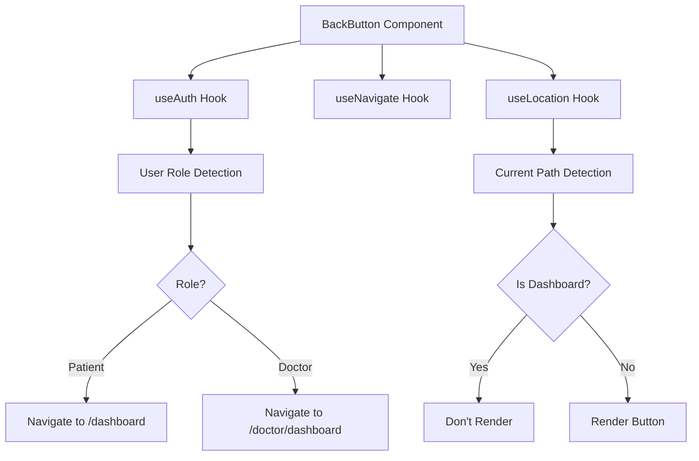
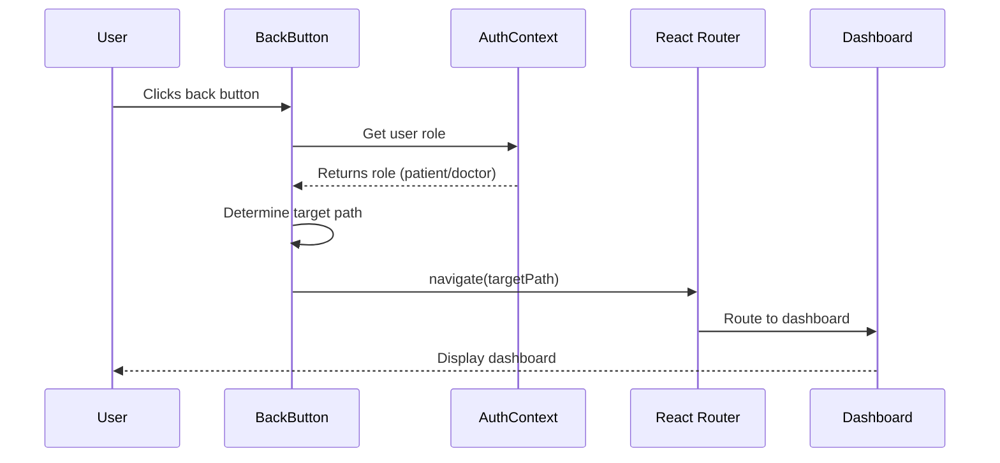
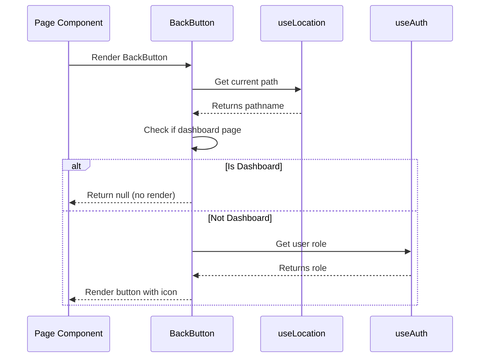
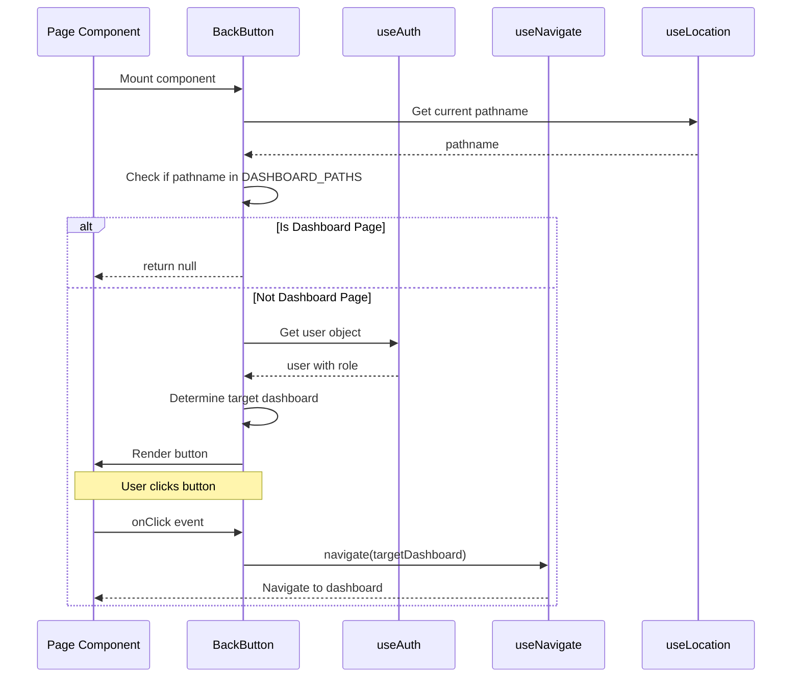

# Design Document: Navigation Back Button

## Overview

This feature adds a reusable back button component to all pages in the CareNav AI application, except for the dashboard pages (patient and doctor). The back button will provide consistent navigation back to the appropriate dashboard based on the user's role, improving the user experience by offering a clear way to return to the main navigation hub. The component will be visually consistent with the existing teal-themed UI design and positioned in the top-left area of page content.

## Architecture

The back button feature follows a component-based architecture that integrates seamlessly with the existing React Router navigation system and AuthContext for role-based routing.



## Sequence Diagrams

### Back Button Click Flow



### Component Mount Flow



## Components and Interfaces

### Component 1: BackButton

**Purpose**: Provides a consistent back navigation button that routes users to their role-appropriate dashboard

**Interface**:
```typescript
interface BackButtonProps {
  className?: string;
  label?: string;
  showLabel?: boolean;
}

function BackButton(props: BackButtonProps): JSX.Element | null
```

**Responsibilities**:
- Detect current route and hide on dashboard pages
- Determine user role from AuthContext
- Navigate to appropriate dashboard based on role
- Render consistent UI with icon and optional label
- Apply custom styling via className prop

**Props**:
- `className` (optional): Additional CSS classes for custom styling
- `label` (optional): Custom label text (default: "Back to Dashboard")
- `showLabel` (optional): Whether to show text label alongside icon (default: true)

### Component 2: Page Layout Wrapper (Optional Enhancement)

**Purpose**: Standardize page layout with consistent back button placement

**Interface**:
```typescript
interface PageLayoutProps {
  children: React.ReactNode;
  showBackButton?: boolean;
  title?: string;
  className?: string;
}

function PageLayout(props: PageLayoutProps): JSX.Element
```

**Responsibilities**:
- Provide consistent page structure
- Include Header component
- Include BackButton component (unless disabled)
- Wrap page content with consistent padding and styling

## Data Models

### User Role Type

```typescript
type UserRole = 'patient' | 'doctor';
```

**Validation Rules**:
- Must be one of the two allowed values
- Used to determine dashboard routing

### Dashboard Route Mapping

```typescript
interface DashboardRoutes {
  patient: string;
  doctor: string;
}

const DASHBOARD_ROUTES: DashboardRoutes = {
  patient: '/dashboard',
  doctor: '/doctor/dashboard'
};
```

**Validation Rules**:
- Routes must match existing route definitions in App.tsx
- Must be absolute paths starting with '/'

### Dashboard Path Detection

```typescript
const DASHBOARD_PATHS = ['/dashboard', '/doctor/dashboard'];
```

**Validation Rules**:
- Array must contain all dashboard paths
- Used for conditional rendering logic

## Main Algorithm/Workflow



## Key Functions with Formal Specifications

### Function 1: BackButton Component

```typescript
function BackButton({ 
  className = '', 
  label = 'Back to Dashboard',
  showLabel = true 
}: BackButtonProps): JSX.Element | null
```

**Preconditions:**
- Component must be rendered within AuthProvider context
- Component must be rendered within Router context
- User must be authenticated (enforced by ProtectedRoute)

**Postconditions:**
- Returns null if current path is a dashboard page
- Returns JSX.Element with button if not on dashboard
- Button click navigates to correct dashboard based on user role
- No side effects on component state or props

**Loop Invariants:** N/A (no loops in component)

### Function 2: getDashboardPath

```typescript
function getDashboardPath(role: UserRole): string
```

**Preconditions:**
- `role` is defined and is either 'patient' or 'doctor'

**Postconditions:**
- Returns '/dashboard' if role is 'patient'
- Returns '/doctor/dashboard' if role is 'doctor'
- Return value is always a valid route string
- No mutations to input parameter

**Loop Invariants:** N/A (no loops)

### Function 3: isDashboardPage

```typescript
function isDashboardPage(pathname: string): boolean
```

**Preconditions:**
- `pathname` is a valid string (may be empty)

**Postconditions:**
- Returns true if pathname matches any dashboard path
- Returns false otherwise
- No side effects on input parameter

**Loop Invariants:** N/A (uses array includes method)

## Algorithmic Pseudocode

### Main BackButton Rendering Algorithm

```pascal
ALGORITHM renderBackButton(props)
INPUT: props of type BackButtonProps
OUTPUT: JSX.Element or null

BEGIN
  // Step 1: Get current location and user context
  location ← useLocation()
  user ← useAuth().user
  navigate ← useNavigate()
  
  // Step 2: Check if current page is a dashboard
  currentPath ← location.pathname
  isDashboard ← isDashboardPage(currentPath)
  
  IF isDashboard = true THEN
    RETURN null
  END IF
  
  // Step 3: Determine target dashboard based on role
  ASSERT user IS NOT NULL
  ASSERT user.role IN ['patient', 'doctor']
  
  targetDashboard ← getDashboardPath(user.role)
  
  // Step 4: Create click handler
  PROCEDURE handleClick()
    navigate(targetDashboard)
  END PROCEDURE
  
  // Step 5: Render button with icon and optional label
  RETURN (
    <button onClick={handleClick} className={mergedClassName}>
      <ArrowLeftIcon />
      IF props.showLabel = true THEN
        <span>{props.label}</span>
      END IF
    </button>
  )
END
```

**Preconditions:**
- Component rendered within AuthProvider and Router
- User is authenticated

**Postconditions:**
- Returns null for dashboard pages
- Returns valid JSX button element for non-dashboard pages
- Button has proper event handler attached

**Loop Invariants:** N/A

### Dashboard Path Resolution Algorithm

```pascal
ALGORITHM getDashboardPath(role)
INPUT: role of type UserRole
OUTPUT: dashboardPath of type string

BEGIN
  ASSERT role IN ['patient', 'doctor']
  
  IF role = 'patient' THEN
    RETURN '/dashboard'
  ELSE IF role = 'doctor' THEN
    RETURN '/doctor/dashboard'
  END IF
  
  // This point should never be reached due to type safety
  THROW Error("Invalid role")
END
```

**Preconditions:**
- role is 'patient' or 'doctor'

**Postconditions:**
- Returns valid dashboard path string
- Path corresponds to user's role

**Loop Invariants:** N/A

### Dashboard Detection Algorithm

```pascal
ALGORITHM isDashboardPage(pathname)
INPUT: pathname of type string
OUTPUT: isDashboard of type boolean

BEGIN
  dashboardPaths ← ['/dashboard', '/doctor/dashboard']
  
  FOR each path IN dashboardPaths DO
    IF pathname = path THEN
      RETURN true
    END IF
  END FOR
  
  RETURN false
END
```

**Preconditions:**
- pathname is a valid string

**Postconditions:**
- Returns true if pathname matches any dashboard path
- Returns false otherwise

**Loop Invariants:**
- All previously checked paths did not match pathname

## Example Usage

### Example 1: Basic Usage in Page Component

```typescript
import BackButton from './components/BackButton';
import Header from './components/Header';

function SymptomInput() {
  return (
    <div className="min-h-screen bg-gray-50">
      <Header />
      <div className="max-w-7xl mx-auto px-4 sm:px-6 lg:px-8 py-6">
        <BackButton />
        <h1 className="text-2xl font-bold text-gray-900 mt-4">
          Describe Your Symptoms
        </h1>
        {/* Rest of page content */}
      </div>
    </div>
  );
}
```

### Example 2: Custom Styling

```typescript
import BackButton from './components/BackButton';

function PatientProfile() {
  return (
    <div className="min-h-screen bg-gray-50">
      <Header />
      <div className="max-w-7xl mx-auto px-4 sm:px-6 lg:px-8 py-6">
        <BackButton 
          className="mb-6" 
          label="Return to Dashboard"
        />
        {/* Page content */}
      </div>
    </div>
  );
}
```

### Example 3: Icon Only (No Label)

```typescript
import BackButton from './components/BackButton';

function DoctorPatientList() {
  return (
    <div className="min-h-screen bg-gray-50">
      <Header />
      <div className="max-w-7xl mx-auto px-4 sm:px-6 lg:px-8 py-6">
        <BackButton showLabel={false} className="mb-4" />
        {/* Page content */}
      </div>
    </div>
  );
}
```

### Example 4: Using PageLayout Wrapper (Optional)

```typescript
import PageLayout from './components/PageLayout';

function ReportUpload() {
  return (
    <PageLayout title="Upload Medical Reports">
      {/* Page content - back button automatically included */}
      <div className="space-y-6">
        {/* Upload form */}
      </div>
    </PageLayout>
  );
}
```

### Example 5: Dashboard Page (No Back Button)

```typescript
import Header from './components/Header';
import BackButton from './components/BackButton';

function Dashboard() {
  return (
    <div className="min-h-screen bg-gray-50">
      <Header />
      <div className="max-w-7xl mx-auto px-4 sm:px-6 lg:px-8 py-6">
        {/* BackButton will return null on dashboard pages */}
        <BackButton />
        <h1 className="text-2xl font-bold text-gray-900">
          Patient Dashboard
        </h1>
        {/* Dashboard content */}
      </div>
    </div>
  );
}
```

## Core Interfaces/Types

```typescript
// BackButton component props
interface BackButtonProps {
  className?: string;
  label?: string;
  showLabel?: boolean;
}

// User role type from AuthContext
type UserRole = 'patient' | 'doctor';

// Dashboard route mapping
interface DashboardRoutes {
  patient: string;
  doctor: string;
}

// Optional: PageLayout component props
interface PageLayoutProps {
  children: React.ReactNode;
  showBackButton?: boolean;
  title?: string;
  className?: string;
}
```

## Correctness Properties

### Property 1: Dashboard Exclusion
```typescript
// For all dashboard pages, BackButton returns null
∀ page ∈ {'/dashboard', '/doctor/dashboard'}: 
  BackButton.render(page) === null
```

### Property 2: Role-Based Navigation
```typescript
// Patient users always navigate to patient dashboard
∀ user where user.role === 'patient':
  BackButton.onClick() → navigate('/dashboard')

// Doctor users always navigate to doctor dashboard
∀ user where user.role === 'doctor':
  BackButton.onClick() → navigate('/doctor/dashboard')
```

### Property 3: Consistent Rendering
```typescript
// For all non-dashboard pages, BackButton renders a button element
∀ page ∉ {'/dashboard', '/doctor/dashboard'}:
  BackButton.render(page) !== null ∧ 
  BackButton.render(page).type === 'button'
```

### Property 4: No Side Effects
```typescript
// BackButton does not modify user state or authentication
∀ state before BackButton.render():
  state.user === state.user after BackButton.render() ∧
  state.token === state.token after BackButton.render()
```

### Property 5: Accessibility
```typescript
// BackButton is keyboard accessible and has proper ARIA attributes
∀ BackButton instances:
  hasAttribute('aria-label') ∧
  isKeyboardAccessible() ∧
  hasFocusIndicator()
```

## Error Handling

### Error Scenario 1: User Not Authenticated

**Condition**: BackButton is rendered but user is null or undefined
**Response**: Component should not crash; ProtectedRoute prevents this scenario
**Recovery**: If somehow reached, component returns null or shows error boundary

### Error Scenario 2: Invalid User Role

**Condition**: User role is neither 'patient' nor 'doctor'
**Response**: Default to patient dashboard as fallback
**Recovery**: Log warning to console for debugging

### Error Scenario 3: Navigation Failure

**Condition**: React Router navigate function fails
**Response**: Catch error and display user-friendly message
**Recovery**: Provide alternative navigation method (e.g., link to dashboard)

### Error Scenario 4: Missing Context

**Condition**: Component rendered outside AuthProvider or Router
**Response**: Throw descriptive error during development
**Recovery**: Error boundary catches and displays helpful message

## Testing Strategy

### Unit Testing Approach

**Test Framework**: Vitest with React Testing Library

**Key Test Cases**:
1. BackButton renders correctly on non-dashboard pages
2. BackButton returns null on dashboard pages
3. Click handler navigates to correct dashboard based on role
4. Custom className prop is applied correctly
5. Label prop customizes button text
6. showLabel prop controls label visibility
7. Component handles missing optional props with defaults
8. Accessibility attributes are present

**Coverage Goals**: 100% line and branch coverage for BackButton component

### Property-Based Testing Approach

**Property Test Library**: fast-check

**Properties to Test**:
1. For any non-dashboard path, component always renders a button
2. For any dashboard path, component always returns null
3. For any valid user role, navigation target is always a valid route
4. Component never throws errors for valid prop combinations
5. Rendered button always has onClick handler attached

### Integration Testing Approach

**Test Scenarios**:
1. BackButton integration with AuthContext for role detection
2. BackButton integration with React Router for navigation
3. BackButton in actual page components (SymptomInput, PatientList, etc.)
4. Navigation flow from various pages back to appropriate dashboard
5. BackButton behavior after user role changes (edge case)

**Tools**: Vitest, React Testing Library, MSW for API mocking

## Performance Considerations

**Rendering Performance**:
- Component is lightweight with minimal re-renders
- Uses React hooks efficiently (useAuth, useNavigate, useLocation)
- No expensive computations or state management
- Memoization not required due to simplicity

**Bundle Size**:
- Component adds minimal JavaScript (~1-2KB)
- Uses existing dependencies (react-router-dom, AuthContext)
- No additional third-party libraries required

**Optimization Strategies**:
- Component can be lazy-loaded if needed
- Icon can be inlined SVG to avoid additional HTTP requests
- Consider using React.memo if parent components re-render frequently

## Security Considerations

**Authentication**:
- Component relies on ProtectedRoute wrapper for authentication
- Does not expose sensitive user information
- Navigation targets are public routes (dashboards)

**Authorization**:
- Role-based navigation ensures users go to appropriate dashboard
- No privilege escalation possible through back button
- Doctor and patient routes remain properly separated

**XSS Prevention**:
- No user input is rendered in component
- Props are type-checked with TypeScript
- Uses React's built-in XSS protection

**CSRF Protection**:
- Navigation is client-side only (no API calls)
- No state mutations that require CSRF protection

## Dependencies

**Required Dependencies** (already in project):
- react (^18.x)
- react-router-dom (^6.x)
- AuthContext (custom context)

**Optional Dependencies**:
- @heroicons/react (for arrow icon) - OR use inline SVG
- classnames or clsx (for className merging) - OR use template literals

**Development Dependencies**:
- @testing-library/react
- @testing-library/user-event
- vitest
- fast-check (for property-based testing)

## Implementation Notes

**File Structure**:
```
frontend/src/
├── components/
│   ├── BackButton.tsx          # Main component
│   ├── PageLayout.tsx          # Optional wrapper component
│   └── __tests__/
│       ├── BackButton.test.tsx
│       └── BackButton.properties.test.tsx
```

**Styling Approach**:
- Use Tailwind CSS classes consistent with existing components
- Follow teal color scheme (teal-600, teal-700)
- Ensure hover and focus states for accessibility
- Responsive design for mobile and desktop

**Integration Steps**:
1. Create BackButton component
2. Add unit tests
3. Add property-based tests
4. Update existing page components to include BackButton
5. Test navigation flows manually
6. Update documentation

**Rollout Strategy**:
- Phase 1: Implement and test BackButton component
- Phase 2: Add to 3-5 high-traffic pages for testing
- Phase 3: Roll out to all remaining pages
- Phase 4: Optional PageLayout wrapper for new pages
