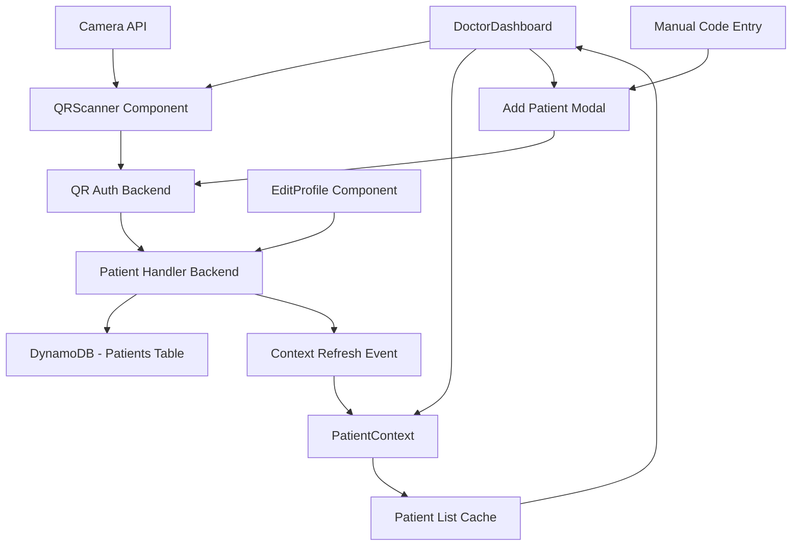
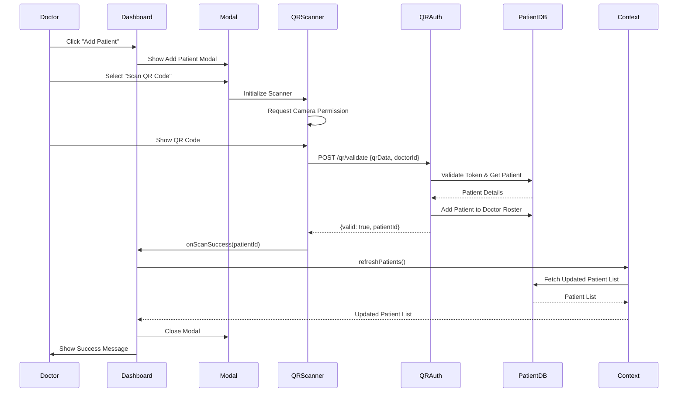
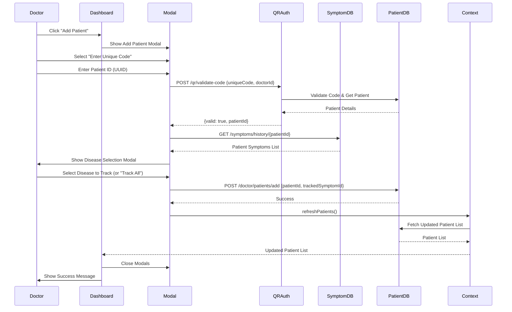
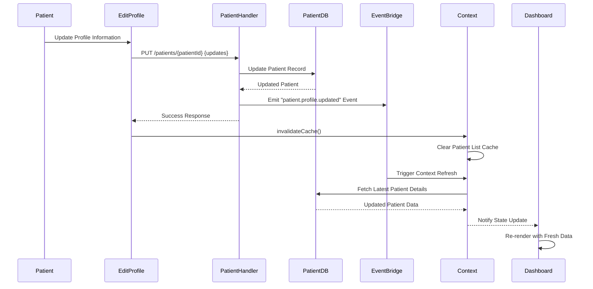

# Design Document: Patient Dashboard QR Scanner

## Overview

This feature integrates QR code scanning functionality into the doctor's patient dashboard, enabling doctors to quickly add patients by scanning their QR codes or entering unique patient codes. The system automatically refreshes the PatientContext whenever a patient profile is updated, ensuring doctors always see the most current patient information. The design leverages existing QRScanner component, PatientContext, and QR authentication backend while adding seamless integration and automatic context synchronization.

The solution provides two primary workflows: (1) QR code scanning for quick patient addition, and (2) automatic context refresh when patient profiles are updated. This ensures efficient patient management and real-time data synchronization across the doctor dashboard.

## Architecture



## Sequence Diagrams

### QR Code Scanning Flow




### Manual Code Entry Flow



### Profile Update Context Refresh Flow




## Components and Interfaces

### Component 1: Enhanced DoctorDashboard

**Purpose**: Main dashboard component that integrates QR scanning functionality and manages patient list display with automatic refresh

**Interface**:
```typescript
interface DoctorDashboardProps {
  doctorId?: string;
}

interface DoctorDashboardState {
  showAddPatientModal: boolean;
  addPatientMode: 'scan' | 'code' | null;
  scanError: string | null;
  scanSuccess: boolean;
}
```

**Responsibilities**:
- Display patient list with search and filter capabilities
- Manage Add Patient modal with QR scan and manual code entry options
- Handle QR scan success/error callbacks
- Trigger PatientContext refresh after patient addition
- Subscribe to patient profile update events
- Display real-time patient information updates

**Key Methods**:
```typescript
handleAddPatientClick(): void
handleScanSuccess(patientId: string): Promise<void>
handleScanError(error: string): void
handleManualCodeSubmit(code: string): Promise<void>
subscribeToProfileUpdates(): void
```

### Component 2: QRScanner Component (Existing - Enhanced)

**Purpose**: Handles QR code scanning using device camera and validates scanned codes

**Interface**:
```typescript
interface QRScannerProps {
  onScanSuccess: (patientId: string) => void;
  onScanError: (error: string) => void;
  doctorId: string;
}

interface QRScannerState {
  scanning: boolean;
  manualCode: string;
  showManualEntry: boolean;
}
```

**Responsibilities**:
- Initialize and manage camera access
- Scan QR codes using html5-qrcode library
- Validate scanned QR data with backend
- Provide manual code entry fallback
- Handle camera permissions and errors

**Key Methods**:
```typescript
startScanning(): Promise<void>
stopScanning(): Promise<void>
handleQRScan(qrData: string): Promise<void>
handleManualCodeSubmit(code: string): Promise<void>
```

### Component 3: Enhanced PatientContext

**Purpose**: Manages patient list state, caching, and automatic refresh on profile updates

**Interface**:
```typescript
interface PatientContextType {
  patients: PatientListItem[];
  totalPages: number;
  loading: boolean;
  error: string | null;
  fetchPatients: (page: number, limit: number, searchQuery?: string, statusFilter?: string[]) => Promise<void>;
  refreshPatients: () => void;
  invalidateCache: () => void;
  updatePatientStatus: (patientId: string, status: 'ongoing' | 'past') => void;
  removePatient: (patientId: string) => void;
  subscribeToUpdates: (callback: () => void) => () => void;
}

interface PatientListItem {
  patientId: string;
  uhid: string;
  name: string;
  age: number;
  gender: string;
  contact: string;
  lastConsultation: string;
  treatmentStatus: 'ongoing' | 'past';
  unreadMessages: number;
  trackedSymptomId?: string;
  trackedDiseaseName?: string;
}
```

**Responsibilities**:
- Maintain patient list cache with 5-minute TTL
- Fetch and refresh patient data from backend
- Invalidate cache on profile updates
- Notify subscribers of data changes
- Handle pagination and filtering
- Manage loading and error states

**Key Methods**:
```typescript
fetchPatients(page, limit, searchQuery, statusFilter): Promise<void>
refreshPatients(): void
invalidateCache(): void
subscribeToUpdates(callback): () => void
updatePatientInCache(patientId, updates): void
```


### Component 4: Enhanced EditProfile Component

**Purpose**: Patient profile editing with automatic context refresh trigger

**Interface**:
```typescript
interface EditProfileProps {
  // Uses AuthContext for user data
}

interface EditProfileState {
  formData: PatientFormData;
  isLoading: boolean;
  isSaving: boolean;
}

interface PatientFormData {
  name: string;
  email: string;
  dateOfBirth: string;
  gender: string;
  bloodGroup: string;
  parentName: string;
  contact: string;
}
```

**Responsibilities**:
- Display patient profile edit form
- Validate and submit profile updates
- Trigger PatientContext cache invalidation on successful update
- Calculate age from date of birth
- Handle form validation and error states

**Key Methods**:
```typescript
loadProfile(): Promise<void>
handleSubmit(e: FormEvent): Promise<void>
calculateAge(dob: string): number
triggerContextRefresh(): void
```

### Component 5: AddPatientModal (New)

**Purpose**: Modal dialog for adding patients via QR scan or manual code entry

**Interface**:
```typescript
interface AddPatientModalProps {
  isOpen: boolean;
  onClose: () => void;
  doctorId: string;
  onPatientAdded: () => void;
}

interface AddPatientModalState {
  mode: 'selection' | 'scan' | 'code' | 'disease-selection';
  manualCode: string;
  loading: boolean;
  error: string | null;
  pendingPatientId: string | null;
  patientSymptoms: SymptomItem[];
  selectedSymptomId: string;
}
```

**Responsibilities**:
- Display mode selection (QR scan vs manual code)
- Embed QRScanner component for scanning
- Handle manual code input and validation
- Show disease selection modal after code validation
- Manage modal state transitions
- Trigger context refresh on successful patient addition

**Key Methods**:
```typescript
handleModeSelection(mode: 'scan' | 'code'): void
handleCodeValidation(code: string): Promise<void>
handleDiseaseSelection(symptomId: string): Promise<void>
handlePatientAddition(patientId: string, symptomId?: string): Promise<void>
```


## Data Models

### Model 1: QRValidationRequest

```typescript
interface QRValidationRequest {
  qrData: string;        // Format: "CARENAV:TOKEN:{tokenId}"
  doctorId: string;      // UUID of the doctor
}
```

**Validation Rules**:
- qrData must be non-empty string
- qrData must match format "CARENAV:TOKEN:{tokenId}"
- doctorId must be valid UUID format

### Model 2: QRValidationResponse

```typescript
interface QRValidationResponse {
  valid: boolean;
  patientId?: string;    // UUID of the patient (if valid)
  uhid?: string;         // Patient UHID (if valid)
  error?: string;        // Error message (if invalid)
}
```

**Validation Rules**:
- valid is required boolean
- If valid is true, patientId and uhid must be present
- If valid is false, error message should be present

### Model 3: UniqueCodeValidationRequest

```typescript
interface UniqueCodeValidationRequest {
  uniqueCode: string;    // Patient ID in UUID format
  doctorId: string;      // UUID of the doctor
}
```

**Validation Rules**:
- uniqueCode must be valid UUID format (36 characters with hyphens)
- doctorId must be valid UUID format
- Both fields are required

### Model 4: PatientAdditionRequest

```typescript
interface PatientAdditionRequest {
  patientId: string;           // UUID of the patient
  addedVia: 'qr_scan' | 'manual_code';
  accessGrantedBy: string;     // Patient ID who granted access
  trackedSymptomId?: string;   // Optional symptom ID to track
}
```

**Validation Rules**:
- patientId must be valid UUID
- addedVia must be either 'qr_scan' or 'manual_code'
- accessGrantedBy must be valid UUID
- trackedSymptomId is optional but must be valid UUID if provided

### Model 5: PatientProfileUpdateEvent

```typescript
interface PatientProfileUpdateEvent {
  eventType: 'patient.profile.updated';
  patientId: string;
  timestamp: string;         // ISO 8601 format
  updatedFields: string[];   // Array of field names that were updated
  updatedBy: string;         // User ID who made the update
}
```

**Validation Rules**:
- eventType must be 'patient.profile.updated'
- patientId must be valid UUID
- timestamp must be valid ISO 8601 date string
- updatedFields must be non-empty array
- updatedBy must be valid UUID

### Model 6: CacheEntry

```typescript
interface CacheEntry {
  data: PatientListItem[];
  totalPages: number;
  timestamp: number;         // Unix timestamp in milliseconds
}
```

**Validation Rules**:
- data must be array of PatientListItem objects
- totalPages must be positive integer
- timestamp must be valid Unix timestamp
- Cache is considered stale if (Date.now() - timestamp) > 300000 (5 minutes)


## Algorithmic Pseudocode

### Main QR Scanning Algorithm

```pascal
ALGORITHM handleQRCodeScanning(doctorId)
INPUT: doctorId of type UUID
OUTPUT: result of type ScanResult

PRECONDITIONS:
  - doctorId is valid and non-null
  - Camera permissions are granted
  - QR scanner component is initialized

POSTCONDITIONS:
  - If successful: patient is added to doctor's roster and context is refreshed
  - If failed: error message is displayed to user
  - Camera is stopped after scan completion

BEGIN
  ASSERT doctorId ≠ null AND isValidUUID(doctorId)
  
  // Step 1: Initialize scanner
  scanner ← initializeQRScanner()
  ASSERT scanner ≠ null
  
  // Step 2: Request camera permission
  permission ← requestCameraPermission()
  IF permission = DENIED THEN
    RETURN Error("Camera permission denied")
  END IF
  
  // Step 3: Start scanning with loop invariant
  scanning ← true
  WHILE scanning DO
    ASSERT scanner.isActive() = true
    
    // Wait for QR code detection
    qrData ← scanner.detectQRCode()
    
    IF qrData ≠ null THEN
      // Step 4: Validate QR code
      validation ← validateQRCode(qrData, doctorId)
      
      IF validation.valid = true THEN
        // Step 5: Add patient to roster
        patientId ← validation.patientId
        addResult ← addPatientToRoster(doctorId, patientId, "qr_scan")
        
        IF addResult.success = true THEN
          // Step 6: Refresh context
          refreshPatientContext()
          scanner.stop()
          scanning ← false
          RETURN Success(patientId)
        ELSE
          RETURN Error(addResult.error)
        END IF
      ELSE
        RETURN Error(validation.error)
      END IF
    END IF
  END WHILE
  
  ASSERT scanning = false
  ASSERT scanner.isActive() = false
END

LOOP INVARIANTS:
  - scanner remains initialized throughout scanning
  - scanning flag accurately reflects scanner state
  - Camera resources are properly managed
```

### Manual Code Validation Algorithm

```pascal
ALGORITHM handleManualCodeEntry(uniqueCode, doctorId)
INPUT: uniqueCode of type String, doctorId of type UUID
OUTPUT: result of type ValidationResult

PRECONDITIONS:
  - uniqueCode is non-empty string
  - doctorId is valid UUID
  - Backend API is accessible

POSTCONDITIONS:
  - If valid: patient symptoms are fetched and disease selection modal is shown
  - If invalid: error message is returned
  - No side effects if validation fails

BEGIN
  ASSERT uniqueCode ≠ "" AND doctorId ≠ null
  
  // Step 1: Validate UUID format
  IF NOT isValidUUID(uniqueCode) THEN
    RETURN Error("Invalid patient ID format. Must be UUID.")
  END IF
  
  // Step 2: Call validation API
  response ← POST("/qr/validate-code", {
    uniqueCode: uniqueCode,
    doctorId: doctorId
  })
  
  IF response.status ≠ 200 THEN
    RETURN Error("API request failed")
  END IF
  
  validation ← response.data
  
  // Step 3: Check validation result
  IF validation.valid = false THEN
    RETURN Error(validation.error OR "Invalid code")
  END IF
  
  patientId ← validation.patientId
  ASSERT patientId ≠ null
  
  // Step 4: Fetch patient symptoms
  symptoms ← fetchPatientSymptoms(patientId)
  
  // Step 5: Show disease selection or add directly
  IF symptoms.length > 0 THEN
    showDiseaseSelectionModal(patientId, symptoms)
    RETURN Pending(patientId, symptoms)
  ELSE
    // No symptoms, add patient without tracking
    addResult ← addPatientToRoster(doctorId, patientId, "manual_code")
    IF addResult.success = true THEN
      refreshPatientContext()
      RETURN Success(patientId)
    ELSE
      RETURN Error(addResult.error)
    END IF
  END IF
END
```


### Context Refresh Algorithm

```pascal
ALGORITHM refreshPatientContext()
INPUT: none
OUTPUT: none (side effect: context state updated)

PRECONDITIONS:
  - PatientContext is initialized
  - Last fetch parameters are stored
  - Backend API is accessible

POSTCONDITIONS:
  - Cache is cleared
  - Fresh patient data is fetched from backend
  - All subscribers are notified of update
  - UI re-renders with new data

BEGIN
  // Step 1: Clear cache
  cache.clear()
  ASSERT cache.size() = 0
  
  // Step 2: Get last fetch parameters
  params ← getLastFetchParams()
  
  IF params = null THEN
    // No previous fetch, use defaults
    params ← {
      page: 1,
      limit: 20,
      searchQuery: "",
      statusFilter: ["ongoing", "past"]
    }
  END IF
  
  // Step 3: Fetch fresh data
  loading ← true
  error ← null
  
  TRY
    response ← GET("/doctor/patients", params)
    
    IF response.status = 200 THEN
      patients ← response.data.patients
      totalPages ← response.data.totalPages
      
      // Step 4: Update state
      setState({
        patients: patients,
        totalPages: totalPages,
        loading: false,
        error: null
      })
      
      // Step 5: Notify subscribers
      FOR EACH subscriber IN subscribers DO
        subscriber.callback()
      END FOR
      
      ASSERT patients.length ≥ 0
      ASSERT totalPages ≥ 1
    ELSE
      error ← "Failed to fetch patients"
      setState({ loading: false, error: error })
    END IF
  CATCH exception
    error ← exception.message
    setState({ loading: false, error: error })
  END TRY
END
```

### Profile Update Detection Algorithm

```pascal
ALGORITHM handleProfileUpdate(patientId, updates)
INPUT: patientId of type UUID, updates of type Object
OUTPUT: result of type UpdateResult

PRECONDITIONS:
  - patientId is valid UUID
  - updates object contains at least one field
  - User has permission to update profile

POSTCONDITIONS:
  - Patient record is updated in database
  - Cache is invalidated
  - Context refresh is triggered
  - Update event is emitted

BEGIN
  ASSERT patientId ≠ null AND isValidUUID(patientId)
  ASSERT updates ≠ null AND Object.keys(updates).length > 0
  
  // Step 1: Validate updates
  validatedUpdates ← validateProfileUpdates(updates)
  
  IF validatedUpdates.errors.length > 0 THEN
    RETURN Error(validatedUpdates.errors)
  END IF
  
  // Step 2: Update database
  TRY
    updatedPatient ← PUT("/patients/" + patientId, validatedUpdates.data)
    
    IF updatedPatient = null THEN
      RETURN Error("Failed to update patient")
    END IF
    
    // Step 3: Invalidate cache
    invalidatePatientCache()
    ASSERT cache.size() = 0
    
    // Step 4: Emit update event
    event ← {
      eventType: "patient.profile.updated",
      patientId: patientId,
      timestamp: getCurrentTimestamp(),
      updatedFields: Object.keys(validatedUpdates.data),
      updatedBy: getCurrentUserId()
    }
    
    emitEvent(event)
    
    // Step 5: Trigger context refresh
    refreshPatientContext()
    
    RETURN Success(updatedPatient)
  CATCH exception
    RETURN Error(exception.message)
  END TRY
END
```


## Key Functions with Formal Specifications

### Function 1: validateQRCode()

```typescript
function validateQRCode(qrData: string, doctorId: string): Promise<QRValidationResponse>
```

**Preconditions:**
- `qrData` is non-null and non-empty string
- `qrData` matches format "CARENAV:TOKEN:{tokenId}"
- `doctorId` is valid UUID format
- Backend QR auth service is accessible

**Postconditions:**
- Returns QRValidationResponse object
- If valid: response.valid === true AND response.patientId is valid UUID
- If invalid: response.valid === false AND response.error contains descriptive message
- No side effects on input parameters
- API call is logged for audit purposes

**Loop Invariants:** N/A (no loops in function)

### Function 2: addPatientToRoster()

```typescript
function addPatientToRoster(
  doctorId: string, 
  patientId: string, 
  addedVia: 'qr_scan' | 'manual_code',
  trackedSymptomId?: string
): Promise<AddPatientResult>
```

**Preconditions:**
- `doctorId` is valid UUID
- `patientId` is valid UUID
- `addedVia` is either 'qr_scan' or 'manual_code'
- `trackedSymptomId` is valid UUID if provided, undefined otherwise
- Doctor-patient relationship does not already exist (or is idempotent)

**Postconditions:**
- Patient is added to doctor's roster in database
- If successful: result.success === true
- If failed: result.success === false AND result.error contains message
- Audit log entry is created
- Doctor-patient relationship record exists in DynamoDB

**Loop Invariants:** N/A (no loops in function)

### Function 3: refreshPatientContext()

```typescript
function refreshPatientContext(): Promise<void>
```

**Preconditions:**
- PatientContext is initialized and mounted
- lastFetchParams state variable exists (may be null)
- Backend patient API is accessible

**Postconditions:**
- Cache is completely cleared (cache.size === 0)
- Fresh patient data is fetched from backend
- patients state is updated with new data
- loading state transitions: false → true → false
- All context subscribers are notified
- If error occurs: error state contains message

**Loop Invariants:**
- For subscriber notification loop: All previously notified subscribers have been called
- Subscriber list remains unchanged during iteration

### Function 4: invalidateCache()

```typescript
function invalidateCache(): void
```

**Preconditions:**
- PatientContext is initialized
- cache Map object exists

**Postconditions:**
- cache.size() === 0
- All cache entries are removed
- No network calls are made
- Context state (patients, loading, error) remains unchanged
- Next fetchPatients call will bypass cache

**Loop Invariants:** N/A (no loops in function)

### Function 5: subscribeToUpdates()

```typescript
function subscribeToUpdates(callback: () => void): () => void
```

**Preconditions:**
- `callback` is a valid function
- PatientContext is initialized
- subscribers Set exists

**Postconditions:**
- callback is added to subscribers Set
- Returns unsubscribe function
- Calling returned function removes callback from subscribers
- No immediate side effects (callback not called during subscription)
- subscribers.size increases by 1

**Loop Invariants:** N/A (no loops in function)


### Function 6: handleProfileUpdate()

```typescript
function handleProfileUpdate(patientId: string, updates: Partial<PatientFormData>): Promise<UpdateResult>
```

**Preconditions:**
- `patientId` is valid UUID
- `updates` object is non-null and contains at least one field
- All fields in updates are valid according to their type constraints
- User has permission to update the patient profile

**Postconditions:**
- Patient record is updated in DynamoDB
- Returns UpdateResult with success status
- If successful: result.success === true AND result.patient contains updated data
- If failed: result.success === false AND result.error contains message
- Cache is invalidated (cache.size === 0)
- Context refresh is triggered
- Update event is emitted to event bus

**Loop Invariants:** N/A (no loops in function)

### Function 7: fetchPatientSymptoms()

```typescript
function fetchPatientSymptoms(patientId: string): Promise<SymptomItem[]>
```

**Preconditions:**
- `patientId` is valid UUID
- Backend symptom API is accessible
- Patient exists in database

**Postconditions:**
- Returns array of SymptomItem objects (may be empty)
- Each symptom has valid symptomId, createdAt, and diseaseAnalysis
- Symptoms are sorted by createdAt descending (most recent first)
- If patient has no symptoms: returns empty array (not null)
- If API error: throws exception with descriptive message

**Loop Invariants:**
- For symptom processing loop: All processed symptoms have valid structure
- Symptom order is maintained (descending by date)

## Example Usage

### Example 1: QR Code Scanning

```typescript
// In DoctorDashboard component
const handleAddPatientClick = () => {
  setShowAddPatientModal(true);
};

const handleScanSuccess = async (patientId: string) => {
  try {
    // Patient already added by QR auth backend
    // Just refresh the context to show new patient
    await refreshPatients();
    
    setShowAddPatientModal(false);
    setAddPatientMode(null);
    
    // Show success message
    toast.success(`Patient added successfully!`);
  } catch (error) {
    setError(error.message);
  }
};

const handleScanError = (error: string) => {
  setError(error);
  toast.error(`QR scan failed: ${error}`);
};

// Render QR Scanner in modal
<AddPatientModal isOpen={showAddPatientModal} onClose={() => setShowAddPatientModal(false)}>
  {addPatientMode === 'scan' && (
    <QRScanner
      doctorId={user.userId}
      onScanSuccess={handleScanSuccess}
      onScanError={handleScanError}
    />
  )}
</AddPatientModal>
```

### Example 2: Manual Code Entry with Disease Selection

```typescript
// In AddPatientModal component
const handleManualCodeSubmit = async () => {
  if (!manualCode.trim() || !doctorId) return;
  
  setLoading(true);
  setError(null);
  
  try {
    // Validate code
    const response = await axios.post('/qr/validate-code', {
      uniqueCode: manualCode.trim(),
      doctorId: doctorId
    });
    
    if (response.data.valid && response.data.patientId) {
      const patientId = response.data.patientId;
      setPendingPatientId(patientId);
      
      // Fetch patient symptoms
      const symptomsResponse = await axios.get(`/symptoms/history/${patientId}`);
      const symptoms = symptomsResponse.data.symptoms || [];
      
      if (symptoms.length > 0) {
        // Show disease selection modal
        setPatientSymptoms(symptoms);
        setMode('disease-selection');
      } else {
        // No symptoms, add patient directly
        await addPatientToRoster(patientId);
      }
    } else {
      setError(response.data.error || 'Invalid code');
    }
  } catch (err) {
    setError(err.message);
  } finally {
    setLoading(false);
  }
};

const handleDiseaseSelection = async () => {
  if (!pendingPatientId) return;
  
  try {
    await axios.post('/doctor/patients/add', {
      patientId: pendingPatientId,
      addedVia: 'manual_code',
      accessGrantedBy: pendingPatientId,
      trackedSymptomId: selectedSymptomId || null
    });
    
    // Refresh context
    await refreshPatients();
    
    // Close modals
    onClose();
    toast.success('Patient added successfully!');
  } catch (err) {
    setError(err.message);
  }
};
```


### Example 3: Automatic Context Refresh on Profile Update

```typescript
// In EditProfile component
const handleSubmit = async (e: React.FormEvent) => {
  e.preventDefault();
  setIsSaving(true);

  try {
    const age = calculateAge(formData.dateOfBirth);
    const updatedPatient = await axiosInstance.put(`/auth/user/${user?.userId}`, {
      name: formData.name,
      email: formData.email,
      dateOfBirth: formData.dateOfBirth,
      age: age,
      gender: formData.gender,
      bloodGroup: formData.bloodGroup,
      parentName: formData.parentName,
      contact: formData.contact
    });
    
    // Invalidate PatientContext cache
    const { invalidateCache } = usePatients();
    invalidateCache();
    
    // Show success message
    alert('Profile updated successfully!');
    
    // Navigate back to dashboard (context will auto-refresh on mount)
    navigate('/dashboard');
  } catch (error) {
    console.error('Failed to update profile:', error);
    alert('Failed to update profile. Please try again.');
  } finally {
    setIsSaving(false);
  }
};
```

### Example 4: Context Subscription in Dashboard

```typescript
// In DoctorDashboard component
useEffect(() => {
  // Subscribe to context updates
  const unsubscribe = subscribeToUpdates(() => {
    console.log('Patient context updated, re-rendering...');
    // Component will automatically re-render due to context state change
  });
  
  // Cleanup subscription on unmount
  return () => {
    unsubscribe();
  };
}, [subscribeToUpdates]);

// Fetch patients on mount and when filters change
useEffect(() => {
  fetchPatients(currentPage, 20, searchQuery, statusFilter);
}, [currentPage, statusFilter, searchQuery, fetchPatients]);
```

### Example 5: Cache Management

```typescript
// In PatientContext
const getCacheKey = (page: number, limit: number, searchQuery?: string, statusFilter?: string[]) => {
  return `${page}-${limit}-${searchQuery || ''}-${statusFilter?.join(',') || ''}`;
};

const fetchPatients = useCallback(async (
  page: number,
  limit: number,
  searchQuery?: string,
  statusFilter?: string[]
) => {
  const cacheKey = getCacheKey(page, limit, searchQuery, statusFilter);
  const cached = cache.get(cacheKey);
  const now = Date.now();

  // Return cached data if fresh (< 5 minutes old)
  if (cached && (now - cached.timestamp) < CACHE_DURATION) {
    setPatients(cached.data);
    setTotalPages(cached.totalPages);
    return;
  }

  // Fetch fresh data
  setLoading(true);
  try {
    const response = await axios.get(`/doctor/patients?${params}`);
    const fetchedPatients = response.data.patients;
    const fetchedTotalPages = response.data.totalPages;

    setPatients(fetchedPatients);
    setTotalPages(fetchedTotalPages);

    // Update cache
    const newCache = new Map(cache);
    newCache.set(cacheKey, {
      data: fetchedPatients,
      totalPages: fetchedTotalPages,
      timestamp: now
    });
    setCache(newCache);
  } catch (err) {
    setError(err.message);
  } finally {
    setLoading(false);
  }
}, [cache]);
```


## Correctness Properties

### Property 1: QR Code Validation Correctness
**Universal Quantification:**
∀ qrData, doctorId: (validateQRCode(qrData, doctorId).valid = true) ⟹ 
  (∃ patient: patient.patientId = validateQRCode(qrData, doctorId).patientId ∧ 
   patient exists in database ∧ 
   qrData format matches "CARENAV:TOKEN:{tokenId}")

**Description:** Every valid QR code validation must correspond to an existing patient in the database, and the QR data must follow the correct format.

### Property 2: Cache Invalidation Completeness
**Universal Quantification:**
∀ profileUpdate: (handleProfileUpdate(patientId, updates) completes successfully) ⟹ 
  (cache.size() = 0 ∧ 
   next fetchPatients() call bypasses cache ∧ 
   fresh data is fetched from backend)

**Description:** Every successful profile update must completely clear the cache and force the next fetch to retrieve fresh data from the backend.

### Property 3: Context Refresh Atomicity
**Universal Quantification:**
∀ refreshOperation: (refreshPatientContext() is called) ⟹ 
  (cache is cleared before fetch ∧ 
   subscribers are notified after state update ∧ 
   loading state transitions correctly: false → true → false)

**Description:** Context refresh operations must be atomic, ensuring cache is cleared before fetching, and subscribers are notified only after state is updated.

### Property 4: Patient Addition Idempotency
**Universal Quantification:**
∀ doctorId, patientId: 
  (addPatientToRoster(doctorId, patientId, addedVia) called multiple times) ⟹ 
  (only one doctor-patient relationship exists ∧ 
   no duplicate entries in roster ∧ 
   subsequent calls do not fail)

**Description:** Adding the same patient multiple times must be idempotent, creating only one relationship record without errors.

### Property 5: Subscriber Notification Consistency
**Universal Quantification:**
∀ subscriber ∈ subscribers: (context state changes) ⟹ 
  (subscriber.callback() is called exactly once per state change ∧ 
   callback is called after state update completes ∧ 
   callback receives current state)

**Description:** All subscribers must be notified exactly once per state change, after the state update is complete, with access to the current state.

### Property 6: Cache Freshness Guarantee
**Universal Quantification:**
∀ cacheEntry: (cacheEntry.timestamp + CACHE_DURATION < Date.now()) ⟹ 
  (cacheEntry is not used ∧ 
   fresh data is fetched from backend ∧ 
   new cache entry is created with current timestamp)

**Description:** Stale cache entries (older than 5 minutes) must never be used; fresh data must always be fetched when cache is stale.

### Property 7: QR Scanner Resource Management
**Universal Quantification:**
∀ scanOperation: (QRScanner component unmounts OR scan completes) ⟹ 
  (camera is stopped ∧ 
   camera resources are released ∧ 
   no memory leaks occur)

**Description:** Camera resources must be properly released when scanning completes or component unmounts, preventing resource leaks.

### Property 8: Error State Consistency
**Universal Quantification:**
∀ operation: (operation fails with error) ⟹ 
  (error state is set with descriptive message ∧ 
   loading state is set to false ∧ 
   user is notified of error ∧ 
   system remains in consistent state)

**Description:** All failed operations must set appropriate error states, stop loading indicators, notify users, and maintain system consistency.

